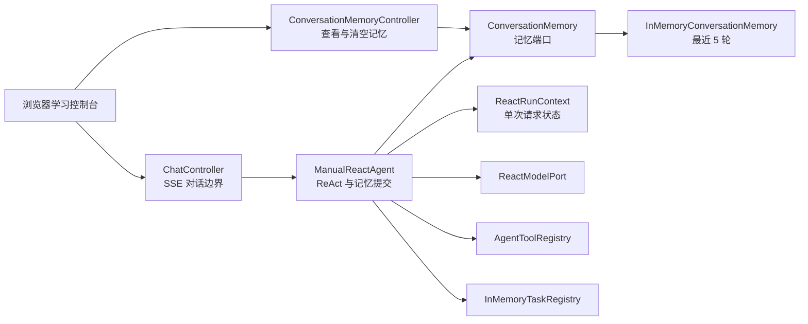
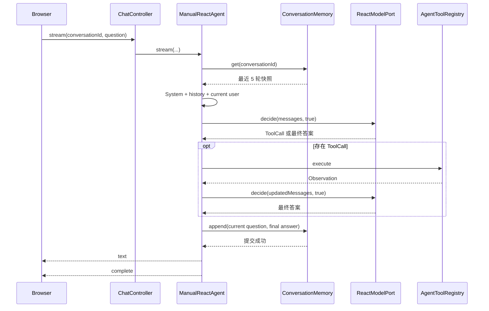

# 第三阶段：进程内窗口式多轮会话记忆设计

> 状态：已确认，等待实现计划  
> 前置阶段：手写 ReAct Agent 与本地工具系统  
> 目标模块：`dodo-agent-learn`

## 1. 背景

第二阶段的 `ManualReactAgent` 可以在一次 HTTP 请求中执行多轮模型决策和工具调用，但请求结束后，`ReactRunContext` 会被释放。相同 `conversationId` 发起下一次请求时，模型仍然只能看到新的用户问题，无法读取之前已经完成的问答。

第三阶段需要让 `conversationId` 从“运行任务索引”扩展为“对话记忆索引”，同时保持两种职责清晰分离：

- `InMemoryTaskRegistry` 管理当前正在运行的任务，任务终止后删除。
- `ConversationMemory` 管理已经成功完成的历史问答，请求终止后继续保留。

本阶段先实现单进程、窗口式、手写记忆，不直接引入数据库、Redis 或 Spring AI `ChatMemory`。这样可以优先理解记忆加载、成功提交、失败回滚、窗口淘汰和跨请求生命周期。

## 2. 阶段目标

### 2.1 功能目标

- 相同 `conversationId` 的新请求可以读取之前成功完成的问答。
- 不同 `conversationId` 的记忆完全隔离。
- 每个会话最多保存最近 5 轮完整问答。
- 一轮记忆只保存用户问题和最终回答。
- 工具调用、工具参数和 Observation 不进入跨请求记忆。
- 模型失败、空回答、主动取消、客户端断开和并发拒绝不保存当前轮。
- 提供查看指定会话记忆的 HTTP 接口。
- 提供清空指定会话记忆的 HTTP 接口。
- 前端可以查看和清空当前 `conversationId` 的记忆。
- 所有行为在不调用真实模型的情况下完成自动化测试。
- 阶段结束时产出独立学习文档和完整伪代码。

### 2.2 学习目标

完成本阶段后，应能解释：

- 一次模型调用、一次 HTTP 请求和一次会话的生命周期差异。
- 为什么 `ReactRunContext` 不适合直接承担跨请求记忆。
- 为什么任务注册表和对话记忆必须是两个组件。
- 为什么记忆保存业务数据而不是框架 `Message` 对象。
- 历史消息如何重新转换为 `UserMessage` 和 `AssistantMessage`。
- 为什么只在最终成功后提交一轮记忆。
- 为什么工具轨迹不应默认长期保存。
- 如何按完整问答轮次执行窗口淘汰。
- 如何为未来数据库或 Redis 实现保留稳定端口。

### 2.3 非目标

- 应用重启后保留历史。
- MySQL、PostgreSQL、Redis 或其他外部存储。
- 多实例之间共享记忆。
- 基于 Token 数量的精确上下文裁剪。
- 自动摘要旧历史。
- 用户账户、会话权限和数据隔离认证。
- 工具调用轨迹持久化。
- 会话列表、标题生成、搜索和分页。
- 修改第二阶段的同步模型决策方式。
- 展示模型内部思维链。

## 3. 核心概念

### 3.1 跨请求

“跨请求”表示一次 HTTP 请求结束后，下一次新的 HTTP 请求仍然能够读取前一次请求成功保存的数据。

示例：

```text
请求 1：conversationId=c-100，message=我叫小明
响应 1：你好，小明
请求 1 完成，SSE 连接关闭

请求 2：conversationId=c-100，message=我叫什么名字
模型上下文包含请求 1 的问答
响应 2：你叫小明
```

### 3.2 三种生命周期

| 概念 | 开始 | 结束 | 是否跨请求 |
| --- | --- | --- | --- |
| 模型决策 | 调用 `model.decide` | 返回 `AssistantMessage` | 否 |
| Agent 请求 | 订阅 `/stream` | SSE `complete` 或客户端断开 | 否 |
| 对话会话 | 第一次成功问答 | 显式清空或应用退出 | 是 |

### 3.3 一轮对话

本阶段的一轮记忆定义为：

```text
ConversationTurn
├── userContent
└── assistantContent
```

一轮必须同时拥有非空用户问题和非空最终回答。半轮数据不能进入记忆。

## 4. 方案选择

### 4.1 选定方案

手写 `ConversationMemory` 端口和 `InMemoryConversationMemory` 实现：

```text
conversationId -> 最近 5 个 ConversationTurn
```

### 4.2 未选择 Spring AI `MessageWindowChatMemory` 的原因

- 框架会隐藏部分记忆读写时机。
- 不利于演示完整问答轮次提交。
- 不利于演示失败和取消时不保存。
- 业务记忆会直接绑定 Spring AI 消息类型。
- 后续替换持久化实现时边界不够清晰。

### 4.3 未选择数据库的原因

- 会同时引入表结构、迁移、事务和连接配置。
- 容易让学习重点从记忆生命周期转向基础设施。
- 单进程内存已经足以验证跨请求行为。
- 稳定端口建立后，下一阶段可单独学习持久化。

## 5. 总体架构



### 5.1 依赖原则

- Web 层不直接读取内部 Map。
- Agent 只依赖 `ConversationMemory` 接口。
- 内存实现不依赖 Spring AI 消息类型。
- `ReactRunContext` 只保存当前请求消息和状态。
- `ConversationMemory` 只保存已经完成的业务问答。
- `InMemoryTaskRegistry` 不保存任何历史内容。

## 6. 核心组件

### 6.1 `ConversationTurn`

不可变业务记录：

```java
public record ConversationTurn(
        String userContent,
        String assistantContent) {
}
```

构造时要求两个字段都非 null、非空白。该类型不包含：

- `Message`。
- `ToolCall`。
- `ToolResponse`。
- SSE 事件。
- 创建线程和 Reactor 状态。

### 6.2 `ConversationMemory`

稳定端口：

```java
public interface ConversationMemory {
    List<ConversationTurn> get(String conversationId);
    void append(String conversationId, ConversationTurn turn);
    boolean clear(String conversationId);
}
```

契约：

- `get` 不存在的会话返回空列表。
- `get` 返回不可修改的防御性快照。
- `append` 原子追加完整轮次并执行窗口淘汰。
- `clear` 返回调用前是否存在历史。
- 空白 `conversationId` 在方法边界拒绝。
- 端口不暴露内部容器。

### 6.3 `InMemoryConversationMemory`

内部结构：

```text
ConcurrentMap<String, ConversationWindow>
```

每个 `ConversationWindow` 自己同步保护：

- 有序轮次列表。
- 追加。
- 读取快照。
- 淘汰最旧轮次。

固定窗口：

```text
MAX_TURNS = 5
```

第 6 轮追加时：

```text
[1, 2, 3, 4, 5] + 6
-> 删除 1
-> [2, 3, 4, 5, 6]
```

淘汰单位是完整 `ConversationTurn`，不会出现只保留 Assistant 或只保留 User 的半轮历史。

### 6.4 `ManualReactAgent`

新增依赖：

```text
ConversationMemory conversationMemory
```

新增职责：

- 请求开始时读取历史快照。
- 将历史业务轮次转换为 Spring AI 消息。
- 在历史之后追加当前用户消息。
- 最终回答通过全部校验后提交当前轮。
- 记忆提交成功后再输出成功 `text`。
- 记忆提交失败走 `error -> complete`。

不新增职责：

- Agent 不直接维护 Map。
- Agent 不提供记忆查询 HTTP 接口。
- Agent 不保存工具中间消息。

### 6.5 `ConversationMemoryController`

提供只读查看和显式清空操作：

```text
GET    /api/agent/conversations/{conversationId}/memory
DELETE /api/agent/conversations/{conversationId}/memory
```

控制器只调用端口并映射响应，不参与 Agent 运行和消息转换。

### 6.6 前端学习控制台

新增：

- “查看记忆”按钮。
- “清空记忆”按钮。
- 当前记忆轮次列表。
- 空历史提示。
- 清空结果状态。

前端继续复用当前自动生成的 `conversationId`。用户不刷新页面时，多次发送请求自然使用同一会话 ID。

## 7. 消息组装规则

### 7.1 首次请求

记忆为空：

```text
SystemMessage(SYSTEM_PROMPT)
UserMessage(currentQuestion)
```

### 7.2 后续请求

已有两轮历史：

```text
SystemMessage(SYSTEM_PROMPT)
UserMessage(historyTurn1.userContent)
AssistantMessage(historyTurn1.assistantContent)
UserMessage(historyTurn2.userContent)
AssistantMessage(historyTurn2.assistantContent)
UserMessage(currentQuestion)
```

### 7.3 当前请求内部工具消息

工具消息只加入当前 `ReactRunContext`：

```text
...历史 User/Assistant
当前 UserMessage
AssistantMessage(ToolCall)
ToolResponseMessage(Observation)
AssistantMessage(finalAnswer)
```

成功提交到跨请求记忆时，只保存：

```text
ConversationTurn(currentQuestion, finalAnswer)
```

下一次请求不会重新加载旧 ToolCall 和旧 Observation。

## 8. 请求数据流



## 9. 成功提交时机

记忆提交发生在：

```text
最终回答已经非空
AND 当前运行未取消
AND 当前运行尚未被其他终止路径完成
AND 尚未向客户端发送 text
```

推荐顺序：

```text
1. 校验 answer 非空
2. 检查 context 未取消
3. 尝试取得 context.tryFinish() 终止权
4. conversationMemory.append(conversationId, turn)
5. tasks.complete(conversationId)
6. emit text(answer)
7. emit complete
8. close sink
```

如果第 4 步失败：

```text
tasks.complete(conversationId)
emit error("会话记忆保存失败：...")
emit complete
close sink
```

因为 `tryFinish()` 已经取得终止权，提交失败必须在同一终止方法内部输出错误，不能再次调用依赖 `tryFinish()` 的普通 `finishWithError`，否则第二次 CAS 会失败且客户端收不到终止事件。

## 10. 失败与取消语义

| 场景 | 读取旧历史 | 保存当前轮 | 输出 |
| --- | --- | --- | --- |
| 直接正常回答 | 是 | 是 | text、complete |
| 工具后正常回答 | 是 | 是 | tool 事件、text、complete |
| 工具返回失败 Observation，最终正常回答 | 是 | 是 | tool 事件、text、complete |
| 模型异常 | 是 | 否 | error、complete |
| 最终回答为空 | 是 | 否 | error、complete |
| 主动停止 | 是 | 否 | request cancelled、complete |
| 客户端断开 | 是 | 否 | 下游不可见，资源清理 |
| 同会话并发拒绝 | 不读取或不使用 | 否 | error、complete |
| 记忆读取失败 | 失败 | 否 | error、complete |
| 记忆保存失败 | 是 | 否 | error、complete，不输出 text |

## 11. 清空语义

### 11.1 无运行任务

```text
DELETE memory
-> 删除全部已完成历史
-> 返回 cleared=true 或 false
```

### 11.2 会话正在运行

清空操作：

- 允许删除请求开始前已经存在的历史。
- 不取消当前 Agent 任务。
- 不修改当前任务已经加载到 `ReactRunContext` 的快照。
- 当前任务成功完成后，保存的新一轮会成为清空后的第一轮。

这体现“读取快照”和“持久记忆容器”是两个不同状态。

## 12. HTTP 接口

### 12.1 查看记忆

请求：

```http
GET /api/agent/conversations/c-100/memory
```

响应：

```json
{
  "conversationId": "c-100",
  "turns": [
    {
      "userContent": "我叫小明",
      "assistantContent": "你好，小明！"
    }
  ]
}
```

不存在会话返回 HTTP 200 和空数组。

### 12.2 清空记忆

请求：

```http
DELETE /api/agent/conversations/c-100/memory
```

有历史：

```json
{"cleared": true}
```

无历史：

```json
{"cleared": false}
```

空白路径参数由 Web 层拒绝，不创建空白会话键。

## 13. 核心伪代码

### 13.1 内存窗口

```text
class InMemoryConversationMemory:
    windows = ConcurrentMap<conversationId, ConversationWindow>
    maxTurns = 5

    function get(conversationId):
        validate conversationId
        window = windows[conversationId]
        if window absent:
            return immutable empty list
        return window.snapshot()

    function append(conversationId, turn):
        validate conversationId and turn
        window = windows.computeIfAbsent(conversationId)
        window.appendAndTrim(turn, maxTurns)

    function clear(conversationId):
        validate conversationId
        return windows.remove(conversationId) != null

class ConversationWindow:
    turns = ordered mutable list

    synchronized function snapshot():
        return immutable copy(turns)

    synchronized function appendAndTrim(turn, maxTurns):
        turns.add(turn)
        while turns.size > maxTurns:
            turns.removeFirst()
```

### 13.2 初始化当前运行消息

```text
function buildInitialMessages(conversationId, currentQuestion):
    turns = conversationMemory.get(conversationId)
    messages = [SystemMessage(SYSTEM_PROMPT)]

    for each turn in turns in original order:
        messages.add(UserMessage(turn.userContent))
        messages.add(AssistantMessage(turn.assistantContent))

    messages.add(UserMessage(currentQuestion))
    return messages
```

### 13.3 成功提交

```text
function finishSuccessfully(conversationId, question, context, output, answer):
    if answer null or blank:
        finishWithError("模型未返回最终答案")
        return

    if context is cancelled:
        return

    if context.tryFinish() == false:
        return

    try:
        turn = ConversationTurn(question, answer)
        conversationMemory.append(conversationId, turn)
    catch memoryError:
        tasks.complete(conversationId)
        output.emit(error("会话记忆保存失败：" + readableMessage(memoryError)))
        output.emit(complete())
        output.close()
        return

    tasks.complete(conversationId)
    output.emit(text(answer))
    output.emit(complete())
    output.close()
```

### 13.4 失败和取消不提交

```text
function finishWithError(...):
    if context.tryFinish():
        do not append memory
        clean task
        emit error
        emit complete
        close

function onCancel(...):
    context.markCancelled()
    if context.tryFinish():
        do not append memory
        emit request-cancelled error
        emit complete
        close
```

## 14. 并发设计

### 14.1 同会话 Agent 请求

现有 `InMemoryTaskRegistry` 继续拒绝同一 `conversationId` 的并发 Agent 请求，因此同一会话正常情况下不会有两个成功轮次同时提交。

### 14.2 不同会话

不同键使用不同 `ConversationWindow`，可以并发读取和追加，不需要全局锁。

### 14.3 查看与追加

`get` 返回某个瞬间的不可变快照。追加可以在快照创建后发生，但不会修改已经返回的列表。

### 14.4 清空与当前运行

当前任务已加载的历史不受后续清空影响。成功结束时允许重新创建窗口并追加当前轮。

## 15. 前端交互

当前页面增加记忆面板：

```text
会话记忆（0/5）              [查看记忆] [清空记忆]

用户：我叫小明
助手：你好，小明
```

规则：

- 页面加载时显示“尚未加载记忆”。
- 点击查看后调用 GET 接口。
- 空数组显示“当前会话暂无已完成问答”。
- 点击清空调用 DELETE 接口，然后刷新面板。
- 发送问题后不自动把未完成内容写入记忆面板。
- 收到 `complete` 后可以自动刷新一次记忆。
- 所有历史内容使用 `textContent` 写入，禁止作为 HTML 注入。

## 16. 测试设计

### 16.1 `ConversationTurnTest`

- 正常构造。
- 空用户问题拒绝。
- 空助手回答拒绝。

### 16.2 `InMemoryConversationMemoryTest`

- 未知会话返回空列表。
- 追加后按顺序读取。
- 两个会话互不影响。
- 第 6 轮淘汰第 1 轮。
- 返回列表不可修改。
- 清空已有会话返回 true。
- 清空未知会话返回 false。

### 16.3 `ManualReactAgentMemoryTest`

- 第一轮成功后保存一轮。
- 第二次相同 ID 的模型输入包含第一轮 User/Assistant。
- 不同 ID 不加载其他会话历史。
- 工具调用和 Observation 不进入下次请求历史。
- 模型异常不保存。
- 空最终回答不保存。
- 主动取消不保存。
- 并发拒绝不保存。
- 记忆读取异常输出 error、complete。
- 记忆保存异常不输出 text，只输出 error、complete。

### 16.4 `ConversationMemoryControllerTest`

- 查看已有历史。
- 查看未知会话返回空数组。
- 清空已有历史。
- 清空未知历史。

### 16.5 `LearningConsoleContractTest`

- 页面存在记忆面板。
- 脚本包含 GET 和 DELETE 地址。
- 历史通过 `textContent` 渲染。
- 页面不包含内部思维链展示。

### 16.6 回归测试

- 第二阶段全部工具和 ReAct 测试继续通过。
- SSE 地址和停止地址保持兼容。
- 运行 `mvn -pl dodo-agent-learn clean test` 成功。

## 17. 实现顺序

1. 定义 `ConversationTurn` 和 `ConversationMemory`。
2. 测试并实现 `InMemoryConversationMemory`。
3. 将历史消息加载集成到 `ManualReactAgent`。
4. 将成功提交集成到正常终止路径。
5. 测试失败、空回答和取消不提交。
6. 实现记忆查看和清空控制器。
7. 实现前端记忆面板。
8. 全量回归和注释审查。
9. 编写第三阶段独立文档和完整伪代码。

## 18. 验收标准

- 同一 `conversationId` 的第二次请求可以看到第一次成功问答。
- 不同会话完全隔离。
- 每个会话严格保留最近 5 轮完整问答。
- 工具中间消息不进入跨请求历史。
- 只有成功最终回答会提交。
- 失败和取消不会产生半轮数据。
- 查看和清空接口符合固定 JSON 结构。
- 前端可以观察和清空当前会话记忆。
- 所有新增与修改代码遵守逐行中文注释规则，导入和注解除外。
- 全量自动化测试通过。
- 第三阶段文档能够脱离未来源码独立复习。

## 19. 后续演进

稳定的 `ConversationMemory` 端口建立后，可以逐步替换为：

- JDBC/MySQL 持久化。
- Redis 窗口记忆。
- 数据库历史加 Redis 热窗口。
- Token 预算裁剪。
- 旧轮次摘要。
- 会话列表、标题和分页。
- 用户级权限和数据隔离。

这些演进不应要求重写 `ManualReactAgent` 的 ReAct 主循环，只替换记忆实现或在端口外增加策略。
