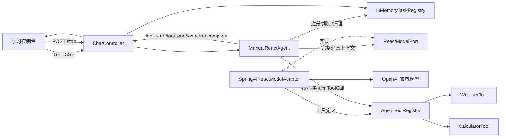

# 第二阶段：手写 ReAct Agent 设计

## 1. 阶段目标

在第一阶段的流式事件、SSE、任务注册和取消机制之上，实现一个完全由学习项目控制的 ReAct 循环。

Spring AI 负责：

- 向模型描述可用工具。
- 解析模型返回的标准 ToolCall。
- 提供 `AssistantMessage`、`ToolResponseMessage` 和 `ToolCallback` 等协议类型。

学习项目负责：

- 保存并更新消息上下文。
- 判断模型本轮是最终回答还是工具调用。
- 查找并执行工具。
- 将工具结果作为 Observation 写回上下文。
- 控制最大轮次、重复工具调用和强制结束。
- 通过 SSE 输出工具生命周期和最终回答。
- 管理取消、异常和资源清理。

第二阶段使用 Spring AI 原生 Tool Calling 协议，但必须关闭框架内部自动工具执行。

## 2. 学习目标

完成第二阶段后，应能够独立解释：

1. ReAct 中 Reason/Act/Observe 的工程实现分别对应什么。
2. `AssistantMessage.ToolCall` 为什么必须进入消息上下文。
3. `ToolResponseMessage` 如何把 Observation 关联回原 ToolCall。
4. 为什么工具执行必须由 Agent 而不是 Controller 管理。
5. Spring AI 自动工具执行隐藏了哪些 Agent 核心机制。
6. 为什么必须限制最大轮次和重复工具调用。
7. 工具异常为什么通常应成为 Observation，而不是直接终止任务。
8. 如何把工具生命周期转换成稳定的前端事件。
9. 阻塞模型调用放入 Reactor 流时的线程和取消边界。
10. 如何用脚本化假模型确定性测试多轮 Agent。

## 3. 范围

### 3.1 包含

- 完全手写的 ReAct 轮次循环。
- Spring AI 标准 ToolCall 与 ToolResponseMessage。
- 本地天气工具。
- 结构化四则运算工具。
- 工具注册、查找和执行。
- 最多四轮常规工具决策。
- 达到轮次限制后禁用工具并强制最终回答。
- 重复工具调用保护。
- `tool_start` 与 `tool_end` SSE 事件。
- 页面工具执行卡片。
- 模型、工具、循环、Controller 和前端契约测试。
- 阶段结束时生成包含核心伪代码快照的学习文档。

### 3.2 不包含

- Spring AI 自动工具执行。
- 模型内部思维链展示。
- 真实天气服务或联网搜索。
- 并行工具执行。
- 多轮持久化对话记忆。
- RAG、MCP、文件工具和 Shell 工具。
- 多 Agent 路由。
- 完全流式的 ToolCall 参数分片合并。
- 对阻塞 HTTP 模型调用的强制网络级中断。

## 4. 方案选择

### 4.1 采用方案

采用“原生 ToolCall + 手写同步轮次决策”：

- 每轮使用完整模型响应判断最终答案或工具调用。
- 工具执行过程通过 SSE 实时输出。
- 最终答案作为一个完整 `text` 事件输出。
- 整个阻塞 ReAct 循环运行在 Reactor `boundedElastic` 线程。

### 4.2 未采用方案

未采用完全流式 ToolCall 合并，因为它会同时引入：

- 工具名称分片合并。
- ToolCall ID 分片合并。
- JSON 参数分片合并。
- 最终回答与工具模式识别。
- 多工具流式顺序协调。

这些机制更接近参考项目，但会掩盖第二阶段要学习的 ReAct 消息循环。

未采用自定义 JSON Action 协议，因为它绕开了标准 Tool Calling，后续无法直接演进到参考项目的 ToolCallback 体系。

## 5. 总体架构



## 6. 核心组件

### 6.1 ManualReactAgent

职责：

- 为每次订阅创建独立运行上下文。
- 注册会话任务。
- 在 `boundedElastic` 执行 ReAct 循环。
- 调用 `ReactModelPort`。
- 判断最终回答或 ToolCall。
- 执行工具并写入 Observation。
- 输出 AgentStreamEvent。
- 处理最大轮次、重复调用、取消和终止。

它不负责：

- HTTP 参数和状态码。
- Spring AI ChatClient 构建。
- 具体工具业务。
- 前端 JSON 解析。

### 6.2 ReactModelPort

建议签名：

```java
AssistantMessage decide(List<Message> messages, boolean toolsEnabled); // 返回模型本轮完整决策。
```

`toolsEnabled=true` 用于常规 ReAct 轮次；`toolsEnabled=false` 用于达到最大轮次后的强制最终回答。

端口使用 Spring AI 的消息协议类型，是有意的学习取舍：Agent 需要直接理解 ToolCall 与 ToolResponseMessage，但不依赖 ChatClient 和具体模型配置。

### 6.3 SpringAiReactModelAdapter

职责：

- 构建 ChatClient。
- 获取 AgentToolRegistry 中的 ToolCallback。
- 设置 `internalToolExecutionEnabled(false)`。
- 根据 `toolsEnabled` 决定是否向模型暴露工具。
- 把完整消息列表发送给模型。
- 返回模型输出的 `AssistantMessage`。

禁用工具的强制回答调用必须使用空工具列表，不能只依赖提示词要求模型不要调用工具。

### 6.4 AgentToolRegistry

职责：

- 保存所有可用 ToolCallback。
- 按工具定义名称查找回调。
- 暴露完整 ToolCallback 列表给模型适配器。
- 使用 ToolCall 的 JSON arguments 执行对应工具。
- 对未知工具抛出可识别异常。

工具注册表不负责吞掉异常。异常转换为 Observation 的策略属于 ManualReactAgent。

### 6.5 WeatherTool

工具名：`get_weather`

输入：

- `city: String`

确定性输出：

- 北京：晴，5°C。
- 上海：多云，12°C。
- 深圳：小雨，28°C。
- 其他城市：暂无天气数据。

工具不访问网络，保证学习和测试结果稳定。

### 6.6 CalculatorTool

工具名：`calculate`

输入：

- `left: BigDecimal`
- `operator: ADD | SUBTRACT | MULTIPLY | DIVIDE`
- `right: BigDecimal`

行为：

- 使用 BigDecimal 执行运算。
- 除法使用明确精度和舍入规则。
- 除数为零时抛出工具执行异常。
- 非法操作符或参数由参数转换/工具逻辑抛出异常。

### 6.7 ReactRunContext

每次订阅独立保存：

- `conversationId`
- `List<Message> messages`
- `Set<String> executedToolSignatures`
- `AtomicBoolean finished`
- `AtomicBoolean cancelled`
- 当前轮次
- 最大轮次，默认 4

消息列表只在该任务的工作线程中更新，不作为跨会话共享状态。

### 6.8 AgentStreamEvent

保留：

- `text`
- `error`
- `complete`

新增：

- `tool_start`
- `tool_end`

建议继续使用单一 record，通过工厂方法保持构造一致。新增字段：

- `toolName`
- `toolCallId`
- `arguments`

`tool_end` 的执行结果放入 `content`。

## 7. ReAct 消息循环

初始消息顺序：

1. SystemMessage：工具调用规则、禁止展示内部思维链、最终回答规则。
2. UserMessage：用户原始问题。

常规轮次：

```text
调用模型
→ 得到 AssistantMessage
→ 没有 ToolCall：作为最终答案
→ 有 ToolCall：先保存 AssistantMessage
→ 依次执行工具
→ 汇总 ToolResponse
→ 保存一个 ToolResponseMessage
→ 进入下一轮
```

ToolCall 与 Observation 的消息顺序必须是：

```text
AssistantMessage(toolCalls)
ToolResponseMessage(responses)
```

不能只保存工具结果而丢弃产生 ToolCall 的 AssistantMessage，否则模型无法把 Observation 与调用请求正确关联。

## 8. 核心伪代码

```text
函数 stream(conversationId, question):
    返回 Flux.defer:
        创建 output Sink
        创建 ReactRunContext
        创建 onCancel 回调

        如果任务注册失败:
            返回 error + complete

        worker = 在 boundedElastic 执行 runLoop(context, output)
        tasks.attach(conversationId, worker)

        返回 output Flux
            doFinally:
                CANCEL -> tasks.cancel
                其他信号 -> tasks.complete
```

```text
函数 runLoop(context, output):
    messages 添加 SystemMessage
    messages 添加 UserMessage(question)

    for round = 1 到 maxRounds:
        如果 cancelled:
            返回

        assistant = model.decide(messages, toolsEnabled=true)

        如果 cancelled:
            返回

        如果 assistant 没有 ToolCall:
            finishWithAnswer(assistant.text)
            返回

        messages 添加 assistant

        responses = 空列表

        for each toolCall in assistant.toolCalls:
            如果 cancelled:
                返回

            signature = toolCall.name + 规范化后的 arguments
            输出 tool_start

            如果 signature 已执行:
                result = 重复工具调用错误
            否则:
                signatures 添加 signature
                result = executeToolSafely(toolCall)

            输出 tool_end

            responses 添加 ToolResponse(
                toolCall.id,
                toolCall.name,
                result
            )

        messages 添加 ToolResponseMessage(responses)

    messages 添加强制最终回答 UserMessage
    assistant = model.decide(messages, toolsEnabled=false)

    如果 cancelled:
        返回

    finishWithAnswer(assistant.text)
```

```text
函数 executeToolSafely(toolCall):
    callback = toolRegistry.find(toolCall.name)

    如果 callback 不存在:
        返回 "工具执行失败：工具不存在"

    try:
        返回 callback.call(toolCall.arguments)
    catch error:
        返回 "工具执行失败：" + 安全错误信息
```

## 9. 最大轮次定义

`maxRounds=4` 表示最多允许四次“工具可用的模型决策”。

四轮结束后：

1. 向消息上下文添加强制最终回答消息。
2. 第五次调用模型。
3. 该调用不提供任何工具。
4. 返回最终文本并结束。

因此强制回答调用不计入常规 ReAct 轮次。

## 10. 重复工具调用

重复签名由以下内容组成：

```text
toolName + 规范化 arguments JSON
```

最低实现可以先使用工具名与原始 arguments 去除首尾空白后的组合。若后续发现 JSON 属性顺序导致误判，再引入 JSON 规范化；第二阶段不提前增加复杂度。

重复调用仍生成 ToolResponse Observation，内容说明调用已被拒绝，不发送第二次真实工具执行。

为了让页面可观察，重复调用也发送 `tool_start` 和 `tool_end`，其中结束结果表示被拒绝。

## 11. 工具执行顺序

同一轮存在多个 ToolCall 时：

- 按模型返回顺序串行执行。
- 每个工具输出自己的 tool_start 和 tool_end。
- ToolResponse 结果保持原顺序。
- 一轮所有工具结束后才进入下一次模型决策。

第二阶段不做并行执行，以便学习消息顺序、事件顺序和错误隔离。

## 12. 事件协议

工具开始：

```json
{
  "type": "tool_start",
  "content": "",
  "toolName": "get_weather",
  "toolCallId": "call-1",
  "arguments": "{\"city\":\"北京\"}"
}
```

工具结束：

```json
{
  "type": "tool_end",
  "content": "北京：晴，5°C",
  "toolName": "get_weather",
  "toolCallId": "call-1",
  "arguments": ""
}
```

最终输出：

```text
tool_start
→ tool_end
→ 可选的更多工具事件
→ text
→ complete
→ Reactor complete
```

错误终止：

```text
error
→ complete
→ Reactor complete
```

不新增 thinking 事件，不输出模型内部思维链。

## 13. 线程与取消

ReAct 循环包含阻塞式 `ChatClient.call()`，必须运行在 `boundedElastic`，不能占用 WebFlux 事件循环线程。

任务注册表保存整个 ReAct worker 的 Disposable。

取消流程：

1. 用户调用停止接口或客户端断开。
2. InMemoryTaskRegistry 移除任务并 dispose worker。
3. onCancel 将 cancelled 和 finished 设置为 true。
4. 输出 error(request cancelled)。
5. 输出 complete。
6. 关闭输出流。
7. 模型调用或工具调用返回后检查 cancelled，丢弃迟到结果。

限制：

- dispose 会尝试取消/中断工作任务。
- 底层阻塞 HTTP 客户端不保证立刻终止网络请求。
- 本阶段保证迟到结果不会继续进入下一轮或输出给客户端。
- 完全响应式网络取消留到后续流式 ToolCall 阶段。

## 14. 错误策略

### 14.1 终止任务的错误

- 模型调用异常。
- 强制最终回答调用异常。
- 最终答案为空。
- Agent 内部不可恢复异常。

处理顺序：

```text
清理任务
→ error
→ complete
→ 关闭 Reactor 流
```

### 14.2 作为 Observation 的错误

- 工具不存在。
- JSON 参数错误。
- 工具执行异常。
- 除数为零。
- 重复工具调用。

这些错误转换成 ToolResponseMessage，允许模型下一轮修正参数、换工具或解释失败。

## 15. 前端设计

页面新增工具执行时间线/卡片：

- tool_start：创建运行中卡片，显示工具名和参数。
- tool_end：按 toolCallId 找到卡片，更新为完成状态并显示结果。
- error：显示任务级错误。
- text：显示最终答案。
- complete：结束加载状态。

前端不解释工具结果，不根据工具名写业务逻辑，只按事件协议展示。

## 16. 兼容与迁移

- `StreamingChatAgent` 保留，作为第一阶段学习对照。
- 默认 ChatController 切换到 `ManualReactAgent`。
- 第一阶段 text/error/complete 事件继续兼容。
- InMemoryTaskRegistry 不修改公共语义。
- 停止接口路径保持不变。
- 对话 SSE 接口路径保持不变。
- 第一阶段前端在忽略新工具字段时仍可显示最终文本。

## 17. 测试策略

### 17.1 ReactModelPort 假实现

使用脚本化响应队列：

```text
第 1 次 decide -> AssistantMessage(toolCalls)
第 2 次 decide -> AssistantMessage(final text)
```

测试可以检查每次传入模型的 messages，确认 AssistantMessage 与 ToolResponseMessage 顺序和内容。

### 17.2 核心测试

至少覆盖：

1. 无工具直接回答。
2. 天气工具后最终回答。
3. 计算工具后最终回答。
4. 同轮多个工具串行执行和事件顺序。
5. 未知工具形成失败 Observation。
6. 参数错误形成失败 Observation。
7. 工具异常形成失败 Observation。
8. 重复工具调用被拒绝且不执行第二次。
9. 四轮后 toolsEnabled=false 强制回答。
10. 最终文本为空时任务级错误。
11. 模型异常时 error + complete。
12. 主动取消后不继续下一轮。
13. 客户端取消时清理任务。
14. Controller SSE JSON 兼容。
15. 前端工具卡片契约。

### 17.3 真实模型验收

自动化测试不调用真实模型。手工验收问题包括：

- “北京天气怎么样？”应调用天气工具。
- “计算 12.5 乘以 8”应调用计算工具。
- “先查上海天气，再计算 7 加 9”应出现两个工具调用。
- “你好”应直接回答，不调用工具。
- 工具执行过程中点击停止，页面应结束且不再进入下一轮。

## 18. 验收标准

- Spring AI 内部工具执行明确关闭。
- Agent 代码中可直接看到完整 ReAct 循环。
- 天气和计算工具均可被模型选择。
- 工具结果以 ToolResponseMessage 写回上下文。
- 工具事件实时通过 SSE 输出。
- 最大轮次和重复调用保护生效。
- 第一阶段停止接口继续可用。
- 自动化测试全部通过。
- Maven 打包成功。
- 产出 `dodo-agent-learn/docs/stages/02-manual-react-agent.md`。
- 阶段文档包含不依赖未来源码的完整伪代码快照。
