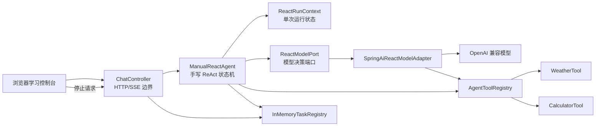
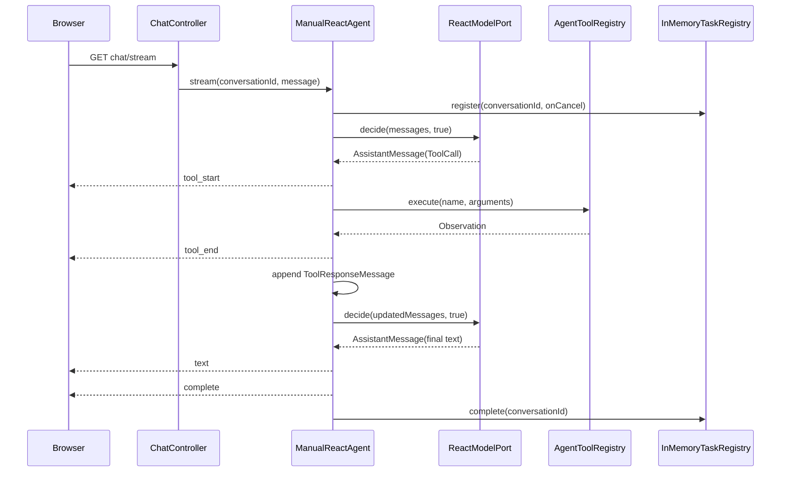

# 第二阶段：手写 ReAct Agent 与本地工具系统

> 状态：已完成  
> 阶段目标：不依赖 Spring AI 自动工具执行，亲手实现模型决策、工具执行、Observation 回填、循环防护和 SSE 可观察事件。  
> 前置阶段：`01-minimal-streaming-agent.md`

## 1. 阶段定位

第一阶段解决的是 Agent 的“运行外壳”：请求如何开始、模型输出如何到达浏览器、任务如何停止、资源如何释放。

第二阶段开始实现 Agent 最核心的自主行动能力：模型不仅生成文本，还可以选择工具；应用程序读取模型的工具调用，真正执行工具，把结果作为新消息交还模型，再让模型决定下一步。

本阶段没有让 Spring AI 自动执行工具。代码明确设置：

```text
internalToolExecutionEnabled = false
```

这样做的学习价值是：

1. 可以看到模型返回的 `ToolCall` 到底是什么。
2. 可以理解 `AssistantMessage` 和 `ToolResponseMessage` 为什么必须成对出现。
3. 可以控制工具调用顺序、错误降级、重复调用和最大轮次。
4. 可以在执行前后输出 `tool_start`、`tool_end` 事件。
5. 可以让停止操作、模型异常和工具异常走不同的处理路径。

## 2. 目标需求

### 2.1 功能目标

- 保留第一阶段的 SSE 对话地址和停止地址。
- 默认对话入口切换为手写 `ManualReactAgent`。
- 支持模型直接回答，不强制调用工具。
- 支持模型在一轮中请求一个或多个工具。
- 多个工具按照模型返回顺序串行执行。
- 工具执行结果通过 `ToolResponseMessage` 回填模型。
- 支持确定性天气工具和精确十进制计算器。
- 浏览器展示工具开始、工具参数、工具结果和最终答案。
- 不向浏览器展示模型内部思维链。
- 单个工具失败不能击穿整个 Agent。
- 同一工具和参数的重复调用不能重复产生真实副作用。
- 最多允许四轮工具决策，之后关闭工具并要求模型立即总结。
- 支持同会话互斥、主动停止和任务资源清理。
- 所有核心逻辑不依赖真实 API key 即可测试。

### 2.2 学习目标

完成本阶段后，应当能够解释：

- ReAct 中 Reason、Action、Observation 的工程含义。
- 模型“选择工具”和应用“执行工具”的区别。
- 为什么工具调用必须保留 `toolCallId`。
- 为什么原始 `AssistantMessage` 必须加入消息历史。
- 为什么多个工具结果可以聚合到一个 `ToolResponseMessage`。
- 为什么工具异常适合变成 Observation，而模型异常需要终止 Agent。
- 为什么阻塞的 `ChatClient.call()` 不能运行在 WebFlux 事件线程。
- 如何防止模型无限调用工具或重复执行有副作用工具。
- 为什么取消通知必须先取得终止权，再中断后台工作。
- 为什么最终页面只展示可验证行动，不展示内部推理文本。

### 2.3 本阶段不实现的内容

- 数据库或 Redis 对话记忆。
- 跨请求的多轮消息持久化。
- 动态工具市场和插件系统。
- MCP 工具协议。
- RAG、知识库和向量检索。
- 多 Agent 路由、计划与反思。
- Token 级最终答案流式输出。
- 分布式任务取消。
- 模型内部隐藏推理过程展示。

本阶段最终答案使用一个完整 `text` 事件输出。这样可以把注意力集中在 ReAct 状态机；后续可以再研究“工具循环结束后如何恢复 Token 流式输出”。

## 3. ReAct 原理

### 3.1 三个核心概念

| 概念 | 工程实现 | 说明 |
| --- | --- | --- |
| Reason | 模型读取当前消息并生成 `AssistantMessage` | 内部推理不向前端展示 |
| Action | `AssistantMessage.ToolCall` | 包含调用编号、工具名和 JSON 参数 |
| Observation | `ToolResponseMessage.ToolResponse` | 应用执行工具后返回给模型的结果 |

一次最小循环如下：

```text
用户问题
  -> 模型决策
  -> 如果没有 ToolCall：输出最终答案
  -> 如果存在 ToolCall：应用执行工具
  -> 构造 ToolResponseMessage
  -> 把 Observation 交给模型再次决策
  -> 直到模型生成最终答案
```

### 3.2 为什么不能只把工具结果拼进字符串

工具调用是模型 API 的结构化协议。模型返回的调用具有唯一编号，工具响应必须用同一个编号关联。如果只拼成普通用户文本，会丢失以下信息：

- 哪个结果对应哪个调用。
- 一轮中多个工具的顺序。
- 助手是否真的发起过工具调用。
- 模型供应商要求的消息角色和协议结构。

因此消息历史必须类似：

```text
SystemMessage
UserMessage
AssistantMessage(toolCalls = [call-1, call-2])
ToolResponseMessage(responses = [response-for-call-1, response-for-call-2])
AssistantMessage(final answer)
```

### 3.3 为什么关闭自动工具执行

如果 Spring AI 自动执行工具，应用通常只能看到模型调用前和最终结果，很难完整掌控：

- 工具开始和结束事件。
- 工具调用去重。
- 工具执行顺序。
- 自定义 Observation 错误文本。
- 最大轮次和强制收尾。
- 每个边界上的取消检查。

本阶段通过 `ToolCallingChatOptions` 显式传入工具回调，同时设置自动执行为 `false`。模型可以“知道并选择”工具，但不能绕过 `ManualReactAgent` 执行工具。

## 4. 总体架构



关键依赖方向：

```text
Web 层 -> Agent 核心 -> 抽象模型端口
                         ^
                         |
                  Spring AI 适配器

Agent 核心 -> 工具注册表 -> 具体本地工具
Agent 核心 -> 任务注册表
```

`ManualReactAgent` 不直接依赖 OpenAI API 类型，也不直接反射调用 `@Tool` 方法。模型适配与工具适配分别封装在边界类中。

## 5. 核心类与职责

### 5.1 `AgentStreamEvent`

稳定的 Agent 输出协议，字段如下：

| 字段 | 用途 |
| --- | --- |
| `type` | 事件类型 |
| `content` | 最终文本、Observation 或错误说明 |
| `toolName` | 工具事件对应名称 |
| `toolCallId` | 关联同一次工具开始和结束 |
| `arguments` | `tool_start` 携带的原始 JSON 参数 |

事件种类：

| 类型 | 产生时机 | 主要字段 |
| --- | --- | --- |
| `tool_start` | 工具真正执行前 | toolName、toolCallId、arguments |
| `tool_end` | 工具执行或降级完成后 | toolName、toolCallId、content |
| `text` | 模型给出最终回答 | content |
| `error` | 模型失败、空回答、取消或并发冲突 | content |
| `complete` | 协议结束 | 空内容 |

### 5.2 `ReactModelPort`

模型决策的最小抽象：

```text
decide(messages, toolsEnabled) -> AssistantMessage
```

它只关心：

- 当前完整消息上下文。
- 本轮是否允许模型选择工具。
- 模型返回的结构化助手消息。

单元测试可以用队列脚本代替真实模型，因此不需要网络和 API key。

### 5.3 `SpringAiReactModelAdapter`

职责：

1. 用 `ChatModel` 创建 `ChatClient`。
2. 将完整 `List<Message>` 放入 Prompt。
3. `toolsEnabled=true` 时声明注册表中的全部工具。
4. `toolsEnabled=false` 时传入空工具集合。
5. 两种情况都设置 `internalToolExecutionEnabled(false)`。
6. 同步调用模型并返回 `AssistantMessage`。

该方法使用阻塞式 `call()`。阻塞隔离由上层 Agent 统一负责。

### 5.4 `WeatherTool`

一个不访问网络的确定性教学工具：

| 城市 | 固定结果 |
| --- | --- |
| 北京 | 晴，25℃ |
| 上海 | 多云，27℃ |
| 深圳 | 阵雨，30℃ |

未知城市返回“暂无某城市的天气数据”，空城市返回校验 Observation。确定性数据让工具测试和课堂实验可以稳定复现。

### 5.5 `CalculatorTool`

使用 `BigDecimal` 支持：

- `ADD`
- `SUBTRACT`
- `MULTIPLY`
- `DIVIDE`

除法固定保留八位小数并使用 `HALF_UP`，最终移除无意义的末尾零。除零、空参数和未知运算符都返回文本 Observation，而不是抛出业务异常。

### 5.6 `AgentToolRegistry`

注册表保存两份一致视图：

- 有序 `List<ToolCallback>`：交给模型声明可用工具。
- `Map<toolName, ToolCallback>`：手写循环按名称真正执行。

它是工具错误边界：

```text
未知工具 -> 工具执行失败：未找到工具 ...
工具抛异常 -> 工具执行失败：异常消息
工具空返回 -> 工具执行失败：工具未返回结果
正常返回 -> 原样 Observation
```

工具错误是模型可以理解和修正的信息，所以不会直接终止 Agent。

### 5.7 `AgentToolConfiguration`

使用 Spring AI `ToolCallbacks.from(weatherTool, calculatorTool)` 读取 `@Tool` 元数据并生成回调，然后创建唯一的 `AgentToolRegistry` Bean。

模型声明与实际执行共享同一个注册表，避免“模型看见了工具，但执行目录中不存在”的配置分裂。

### 5.8 `ReactRunContext`

每次订阅创建一个上下文实例，绝不能成为单例 Bean。它保存：

- 有序消息历史。
- 已开始的工具决策轮次。
- 最大轮次。
- 已执行工具签名集合。
- 原子取消状态。
- 原子完成状态。

工具签名规则：

```text
signature = toolName + 换行符 + trim(rawArguments)
```

只清理首尾空格，不重新序列化 JSON。这样规则简单、可预测，也不会因为 JSON 库重排字段而偷偷改变判定方式。

### 5.9 `ManualReactAgent`

核心职责：

- 创建初始 System/User 消息。
- 注册会话任务。
- 将阻塞循环调度到 `boundedElastic`。
- 请求模型决策。
- 判断最终答案或 ToolCall。
- 串行执行工具。
- 输出工具生命周期事件。
- 构造并追加 `ToolResponseMessage`。
- 执行重复调用和最大轮次防护。
- 处理模型异常、空回答和取消。
- 关闭事件流并释放任务。

### 5.10 `InMemoryTaskRegistry`

沿用第一阶段的会话互斥和订阅管理。本阶段调整了主动取消顺序：

```text
1. 从任务 Map 原子移除条目
2. 标记条目 closed
3. 执行 onCancel，让 Agent 先取得终止闸门
4. dispose 后台工作订阅
```

如果先 `dispose`，阻塞模型可能因线程中断抛出异常，异常路径会抢先输出“模型失败”，用户看到的就不是“request cancelled”。先通知 Agent 可以固定取消语义。

### 5.11 `ChatController`

URL 保持不变：

```text
GET  /api/agent/chat/stream
POST /api/agent/tasks/{conversationId}/stop
```

控制器只把 `AgentStreamEvent` 映射为 `ServerSentEvent`：

```text
SSE event = AgentStreamEvent.type
SSE data  = AgentStreamEvent JSON
```

默认依赖由 `StreamingChatAgent` 切换为 `ManualReactAgent`，阶段一类仍然保留用于对比学习。

## 6. 完整运行时序



## 7. 核心实现伪代码

以下伪代码保存本阶段完整实现思想。即使未来代码被重构，也可以仅依据本节重新实现。

### 7.1 入口和线程隔离

```text
function stream(conversationId, userText):
    return defer per subscriber:
        context = new ReactRunContext(
            messages = [SystemMessage(SYSTEM_PROMPT), UserMessage(userText)],
            maxRounds = 4
        )
        output = new unicast buffered sink

        onCancel = function:
            context.markCancelled()
            if context.tryFinish():
                output.emit(error("request cancelled"))
                output.emit(complete())
                output.close()

        if taskRegistry.register(conversationId, onCancel) == false:
            return [error("conversation is already running"), complete()]

        worker = runBlocking(
            action = runReactLoop(conversationId, context, output),
            scheduler = boundedElastic
        )
        taskRegistry.attach(conversationId, worker)

        return output.asFlux().finally(signal):
            if signal == downstream-cancel:
                taskRegistry.cancel(conversationId)
            else:
                taskRegistry.complete(conversationId)
```

### 7.2 主 ReAct 循环

```text
function runReactLoop(conversationId, context, output):
    try:
        while context is not cancelled
              and context.tryStartDecisionRound() == true:

            assistant = model.decide(context.messagesSnapshot(), toolsEnabled=true)

            if context is cancelled:
                discard assistant
                return

            context.addMessage(assistant)

            if assistant has no tool calls:
                finishSuccessfully(assistant.text)
                return

            executeToolCalls(context, output, assistant.toolCalls)

        if context is not cancelled:
            context.addMessage(UserMessage(
                "工具调用已达到上限，请基于已有观察立即总结，不能再调用工具"
            ))

            finalAssistant = model.decide(
                context.messagesSnapshot(),
                toolsEnabled=false
            )

            if context is cancelled:
                discard finalAssistant
                return

            context.addMessage(finalAssistant)

            if finalAssistant still contains tool calls:
                finishWithError("模型在强制收尾阶段仍请求工具")
                return

            finishSuccessfully(finalAssistant.text)

    catch unexpected model-or-loop-error:
        finishWithError(readableErrorMessage)
```

### 7.3 工具串行执行和 Observation 回填

```text
function executeToolCalls(context, output, toolCalls):
    responses = empty ordered list

    for each toolCall in toolCalls in original order:
        output.emit(tool_start(
            toolName = toolCall.name,
            toolCallId = toolCall.id,
            arguments = toolCall.arguments
        ))

        isFirstExecution = context.markToolExecution(
            toolCall.name,
            toolCall.arguments
        )

        if isFirstExecution:
            observation = toolRegistry.execute(
                toolCall.name,
                toolCall.arguments
            )
        else:
            observation = "工具调用已跳过：检测到重复调用"

        output.emit(tool_end(
            toolName = toolCall.name,
            toolCallId = toolCall.id,
            content = observation
        ))

        responses.add(ToolResponse(
            id = toolCall.id,
            name = toolCall.name,
            responseData = observation
        ))

    context.addMessage(ToolResponseMessage(responses))
```

### 7.4 工具注册表

```text
constructor AgentToolRegistry(callbacks):
    immutableCallbacks = copy(callbacks)
    callbacksByName = empty ordered map

    for callback in immutableCallbacks:
        name = callback.toolDefinition.name
        if name already exists:
            fail startup with duplicate-tool-name error
        callbacksByName[name] = callback

function callbacks():
    return new array copied from immutableCallbacks

function execute(toolName, rawArguments):
    callback = callbacksByName[toolName]

    if callback does not exist:
        return "工具执行失败：未找到工具 " + toolName

    try:
        result = callback.call(rawArguments)
        if result is null or blank:
            return "工具执行失败：工具未返回结果"
        return result
    catch toolError:
        message = toolError.message or toolError.classSimpleName
        return "工具执行失败：" + message
```

### 7.5 正常、错误和取消终止

```text
function finishSuccessfully(answer):
    if answer is null or blank:
        finishWithError("模型未返回最终答案")
        return

    if context.tryFinish():
        taskRegistry.complete(conversationId)
        output.emit(text(answer))
        output.emit(complete())
        output.close()

function finishWithError(message):
    if context.tryFinish():
        taskRegistry.complete(conversationId)
        output.emit(error(message))
        output.emit(complete())
        output.close()

function onCancel():
    context.markCancelled()
    if context.tryFinish():
        output.emit(error("request cancelled"))
        output.emit(complete())
        output.close()
```

三个方法共享 `tryFinish()` 原子闸门。因此正常结果、模型异常、主动取消和线程中断即使同时到达，也只有一个路径能发送终止协议。

### 7.6 前端工具卡片

```text
toolCards = Map<toolCallId, DOMCard>

on tool_start event:
    remove empty placeholder
    card = create card
    card shows toolName
    card shows formatted arguments
    card state = running
    append card in event order
    toolCards[event.toolCallId] = card

on tool_end event:
    card = toolCards[event.toolCallId]
    if card missing:
        ignore isolated end event
    else:
        card state = complete
        card shows event.content as Observation

on text event:
    append final answer to answer area

never render hidden reasoning fields
always write model/tool data with textContent
```

## 8. 边界与失败语义

| 场景 | 是否执行工具 | Agent 是否终止 | 对外结果 |
| --- | --- | --- | --- |
| 模型直接回答 | 否 | 正常终止 | text、complete |
| 一个或多个合法工具 | 是，串行 | 继续循环 | tool_start、tool_end |
| 未知工具 | 否 | 不终止 | 失败 Observation |
| 工具参数无法解析 | 回调失败 | 不终止 | 失败 Observation |
| 工具业务异常 | 执行失败 | 不终止 | 失败 Observation |
| 工具返回空值 | 已调用 | 不终止 | 失败 Observation |
| 重复工具签名 | 不再次执行 | 不终止 | 跳过 Observation |
| 四轮仍请求工具 | 第四轮后停止 | 强制总结 | 第五次模型调用关闭工具 |
| 强制总结仍含 ToolCall | 不执行 | 错误终止 | error、complete |
| 最终回答为空 | 否 | 错误终止 | error、complete |
| 模型调用异常 | 否 | 错误终止 | error、complete |
| 同会话并发 | 不调用模型 | 立即结束 | error、complete |
| 主动停止 | 中断后台工作 | 取消终止 | request cancelled、complete |
| 浏览器断开 | 中断后台工作 | 清理资源 | 下游已断开，不保证可见事件 |

## 9. 并发和取消原则

### 9.1 为什么使用 `boundedElastic`

WebFlux 事件线程数量有限，适合短小的非阻塞任务。`ChatClient.call()` 会等待网络响应，是阻塞操作。如果直接在事件线程执行，一个慢模型请求可能拖慢其他所有请求。

本阶段把整个同步循环放入 `Schedulers.boundedElastic()`：

- 不阻塞 Netty 事件线程。
- 单次运行仍在同一工作序列中执行。
- 多工具自然串行，Observation 顺序稳定。
- `Disposable` 可以交给任务注册表取消。

### 9.2 最佳努力取消

取消能够：

- 立即标记上下文取消。
- 关闭对外事件流。
- dispose Reactor 工作订阅。
- 尝试中断正在阻塞的模型调用。

但底层 HTTP 客户端或模型服务是否立刻停止计算，取决于驱动和远端实现。因此系统还必须在模型返回后再次检查 `isCancelled()`，丢弃迟到结果。

### 9.3 为什么需要两种原子状态

- `cancelled`：告诉工作循环不再接受任何迟到结果。
- `finished`：保证对外终止事件最多发送一次。

取消是一种原因，完成闸门是一种协议所有权。两者不能简单合并。

## 10. 安全配置

配置文件只引用环境变量：

```yaml
spring:
  ai:
    openai:
      api-key: ${OPENAI_API_KEY:}
```

Windows PowerShell 启动示例：

```powershell
$env:OPENAI_API_KEY = "你的密钥"
mvn -pl dodo-agent-learn spring-boot:run
```

不要把真实密钥写入 YAML、Java 代码、启动参数截图或提交历史。测试使用假模型端口或测试占位值，不调用真实服务。

## 11. 测试策略

### 11.1 单元测试覆盖

- `AgentStreamEventTest`：五类事件结构。
- `WeatherToolTest`：固定城市、空白和未知城市。
- `CalculatorToolTest`：四则运算、精度、除零和非法输入。
- `AgentToolRegistryTest`：声明、执行、未知工具、异常和空返回。
- `ReactModelPortTest`：模型边界可以无 API key 替换。
- `SpringAiReactModelAdapterTest`：工具开关和关闭自动执行。
- `ReactRunContextTest`：消息、四轮上限、签名去重和原子状态。
- `ManualReactAgentTest`：直接回答、单工具、多工具、重复调用、强制总结、异常、并发和取消。
- `ChatControllerTest`：SSE event/data、参数校验和停止接口。
- `LearningConsoleContractTest`：工具容器、事件分支、调用编号以及禁止内部推理展示。

### 11.2 验证命令

```powershell
mvn -pl dodo-agent-learn clean test
```

本阶段完成时测试结果：

```text
Tests run: 34
Failures: 0
Errors: 0
Skipped: 0
BUILD SUCCESS
```

### 11.3 推荐手工实验

启动后可尝试：

1. “你好，请介绍你自己。”——观察模型直接回答。
2. “北京天气怎么样？”——观察 weather 工具卡片。
3. “先查上海天气，再计算 12.5 乘以 8。”——观察同轮或多轮多工具调用。
4. “查询杭州天气。”——观察未知城市成为普通 Observation。
5. 在模型响应期间点击停止——观察任务取消和按钮状态恢复。

## 12. 与第一阶段的区别

| 维度 | 第一阶段 | 第二阶段 |
| --- | --- | --- |
| 核心 Agent | StreamingChatAgent | ManualReactAgent |
| 模型接口 | Flux 文本片段 | AssistantMessage 决策 |
| 模型调用 | stream | 同步 call，外层线程隔离 |
| 工具 | 无 | 天气、计算器 |
| 循环 | 单次模型请求 | 最多四轮 Action/Observation |
| 最终文本 | Token 片段 | 一个完整 text 事件 |
| SSE 类型 | text/error/complete | 增加 tool_start/tool_end |
| 防护 | 会话互斥、取消 | 增加重复调用、轮次上限、工具错误降级 |
| 页面 | 文本输出 | 工具轨迹和最终回答分区 |

## 13. 后续可扩展点

在保持现有边界的前提下，后续阶段可以逐步加入：

- 跨请求的会话消息记忆。
- 对话上下文裁剪和 Token 预算。
- 工具输入参数的前置 Schema 校验。
- 带超时、重试和熔断的外部工具。
- 工具权限、审批和副作用分级。
- 最终回答 Token 流式输出。
- 持久化任务和分布式取消。
- RAG、文件读取、搜索和 MCP。
- Plan-and-Execute、多 Agent 和反思机制。

无论增加什么能力，都应继续保留本阶段建立的边界：模型负责提出结构化 Action，应用负责验证和执行，Observation 通过正式消息协议回填，生命周期由 Agent 显式管理。

## 14. 阶段验收结论

第二阶段已经形成一个完整、可运行的手写 ReAct Agent：

- 模型可以直接回答或选择工具。
- 工具由应用代码人工执行。
- Observation 被结构化回填。
- 工具过程通过 SSE 可观察。
- 页面不展示内部思维链。
- 错误、重复、轮次、并发和取消都有明确边界。
- 34 个自动化测试全部通过。
- 核心算法已通过本文件的独立伪代码永久保存。
