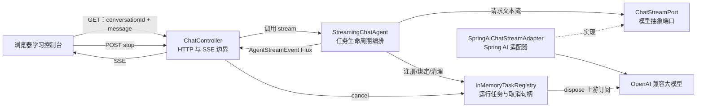
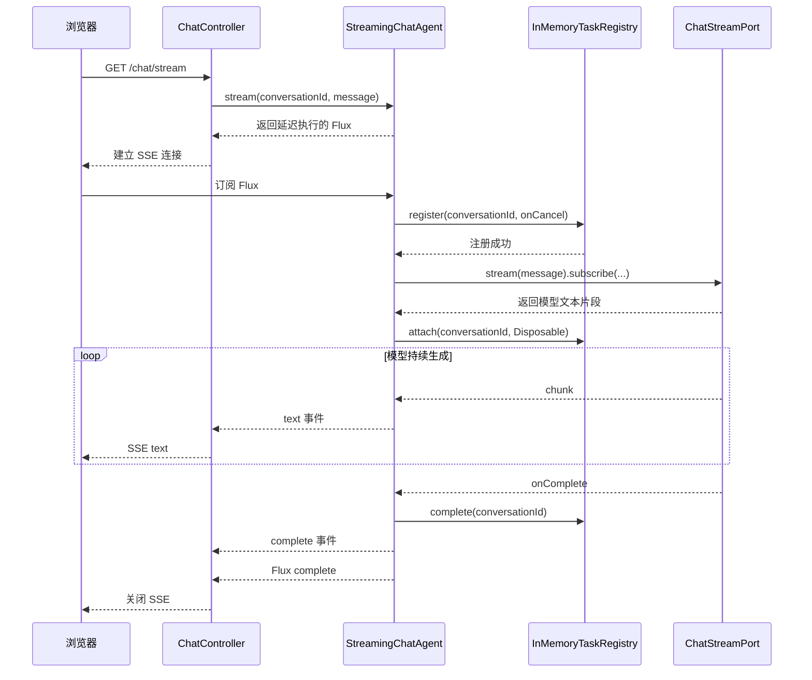
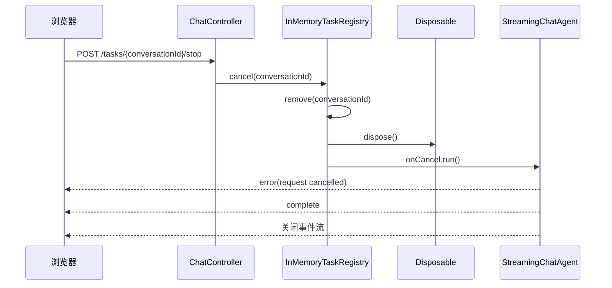
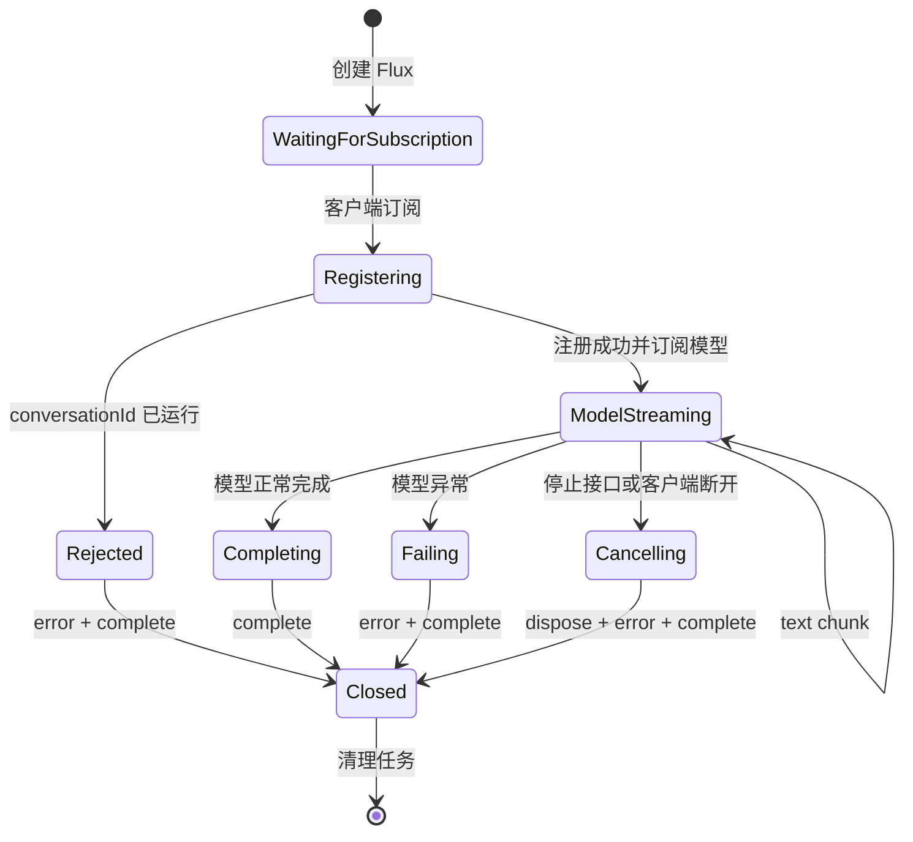

# 第一阶段：最小流式 Agent 系统

> 状态：已完成  
> 阶段目标：从零搭建一个可运行、可测试、可取消的单轮流式 Agent，理解 Agent 系统最基础的运行边界。  
> 对照项目：`LLMentor/agent/dodo-agent`

## 1. 阶段定位

第一阶段没有直接复制参考项目中的完整 Agent 框架，而是先提炼它最基础、最重要的运行链路：

1. 用户发起一次对话请求。
2. 后端调用大模型并接收流式文本。
3. Agent 把模型文本转换为稳定事件。
4. HTTP 层通过 SSE 把事件持续推送给浏览器。
5. 系统记录正在运行的任务。
6. 用户可以主动停止任务。
7. 无论成功、失败、取消还是客户端断开，系统都会释放任务资源。

这一阶段实现的是一个“最小 Agent 运行外壳”。它已经具备 Agent 系统的生命周期管理能力，但还没有工具选择、ReAct 循环、记忆、RAG 等高级能力。

## 2. 目标需求

### 2.1 功能目标

- 提供单轮大模型问答能力。
- 支持模型内容流式输出，而不是等待完整答案后一次性返回。
- 使用统一事件协议传递文本、错误和完成状态。
- 使用 `conversationId` 标识正在运行的任务。
- 防止同一个 `conversationId` 同时启动多个任务。
- 支持通过停止接口取消上游模型订阅。
- 客户端断开连接时自动取消对应任务。
- 模型正常结束、异常结束或主动取消后都要清理任务。
- 提供最小浏览器页面，用于发送问题、查看流式结果和停止任务。
- 所有核心行为都可以在不调用真实模型的情况下自动测试。

### 2.2 学习目标

完成这一阶段后，应当能够解释：

- Agent 和普通大模型调用之间的区别。
- 为什么流式返回适合 Agent。
- Reactor `Flux` 的延迟执行与订阅机制。
- 为什么需要单独定义模型调用端口。
- SSE 如何承载 Agent 事件。
- 为什么“停止前端显示”不等于“取消模型任务”。
- 如何保存并释放 Reactor 的 `Disposable`。
- 如何处理正常完成、异常、主动取消和客户端断开。
- 如何阻止同一会话重复运行。
- 如何处理“取消先发生、模型订阅稍后才绑定”的并发竞争。

### 2.3 本阶段不实现的内容

- 工具定义和工具调用。
- ReAct 的 Thought、Action、Observation 循环。
- 多轮对话历史和长期记忆。
- 数据库持久化。
- Redis 分布式任务协调。
- RAG、向量数据库和知识库。
- MCP、联网搜索、文件处理和 PPT 生成。
- 多 Agent 路由和任务规划。
- 模型内部思考过程展示。

这些能力会在后续阶段逐步增加，避免在还没有理解生命周期时就引入过多框架复杂度。

## 3. 技术方案

### 3.1 技术栈

| 技术 | 第一阶段用途 |
| --- | --- |
| Java 21 | 项目开发语言 |
| Spring Boot 3.5 | 应用启动、自动配置和依赖注入 |
| Spring WebFlux | 非阻塞 HTTP 接口与 SSE 输出 |
| Spring AI | 对接 OpenAI 兼容模型服务 |
| Project Reactor | 使用 `Flux`、`Sinks` 和 `Disposable` 管理流 |
| Maven | 依赖管理、测试和打包 |
| JUnit 5 / Reactor Test | Agent、任务注册表和接口测试 |
| 原生 HTML/CSS/JavaScript | 最小学习控制台 |

### 3.2 搭建步骤

1. 创建独立 Maven 模块 `dodo-agent-learn`。
2. 引入 WebFlux、Spring AI OpenAI Starter、测试和 Reactor Test。
3. 创建 Spring Boot 启动类和安全的外部化配置。
4. 定义稳定的 Agent 流事件协议。
5. 定义模型流端口，并使用 Spring AI 实现适配器。
6. 实现内存任务注册表。
7. 实现单轮流式 Agent。
8. 实现 SSE 对话接口与停止接口。
9. 实现最小浏览器控制台。
10. 使用假模型完成自动化测试。
11. 完成 Maven 测试、打包和页面冒烟验证。

## 4. 总体架构



系统被划分为四个边界：

- Web 边界：只理解 HTTP、参数、状态码和 SSE。
- Agent 核心：只理解任务生命周期和 Agent 事件。
- 模型边界：只向 Agent 暴露文本 `Flux`。
- 任务边界：只管理运行任务、订阅句柄和取消状态。

这种划分使后续增加工具调用、记忆或不同模型时，不需要重写 HTTP 和任务取消机制。

## 5. 请求执行链路

### 5.1 正常请求时序



最重要的一点是：调用 `agent.stream(...)` 时并不会立即执行模型请求。真正执行发生在 WebFlux 订阅返回的 `Flux` 时，这就是 Reactor 的延迟执行模型。

### 5.2 主动停止时序



停止操作必须调用 `Disposable.dispose()`，这样才能终止上游模型流和网络请求。如果只在浏览器中停止读取，模型仍可能继续生成并消耗资源。

## 6. 核心类

| 核心类 | 职责 | 不应该承担的职责 |
| --- | --- | --- |
| `DodoAgentLearnApplication` | 启动 Spring Boot 应用 | Agent 业务逻辑 |
| `AgentStreamEvent` | 定义稳定的输出事件协议 | HTTP/SSE 序列化细节 |
| `ChatStreamPort` | 定义 Agent 所需的最小模型能力 | Spring AI 或厂商实现细节 |
| `SpringAiChatStreamAdapter` | 把 Spring AI 响应适配为文本 `Flux` | 任务注册、取消和事件转换 |
| `StreamingChatAgent` | 编排一轮 Agent 的完整生命周期 | HTTP 参数和状态码 |
| `InMemoryTaskRegistry` | 保存任务、绑定订阅、取消和清理 | 模型提示词和 SSE |
| `ChatController` | 参数校验、SSE 封装和停止接口 | 模型调用细节和并发状态 |

### 6.1 DodoAgentLearnApplication

源码：[DodoAgentLearnApplication.java](../../src/main/java/com/jaycong/dodo/DodoAgentLearnApplication.java)

它是整个模块的启动入口，主要完成：

- 创建 Spring 应用上下文。
- 执行 Spring Boot 自动配置。
- 扫描并装配 Controller、Agent、模型适配器和任务注册表。
- 启动内嵌 WebFlux 服务。

启动类应保持简单，不应该放入 Agent 业务逻辑。

### 6.2 AgentStreamEvent

源码：[AgentStreamEvent.java](../../src/main/java/com/jaycong/dodo/agent/AgentStreamEvent.java)

事件结构：

```text
AgentStreamEvent(type, content)
```

第一阶段定义三类事件：

| type | content | 含义 |
| --- | --- | --- |
| `text` | 模型文本片段 | 本轮生成的增量内容 |
| `error` | 错误描述 | 模型异常、取消或重复会话 |
| `complete` | 空字符串 | Agent 协议层明确结束 |

Agent 使用自己的事件协议，而不是直接返回 Spring AI 的响应对象。这样做有三个好处：

1. HTTP 层不会依赖具体模型 SDK。
2. 后续可以增加 `tool_start`、`tool_end`、`observation` 等事件。
3. 测试可以直接断言 Agent 行为，不需要构造复杂的模型响应对象。

### 6.3 ChatStreamPort

源码：[ChatStreamPort.java](../../src/main/java/com/jaycong/dodo/agent/ChatStreamPort.java)

端口只定义一个能力：

```java
Flux<String> stream(String message); // 接收用户消息并返回模型文本片段流。
```

这里采用了依赖倒置：

- Agent 核心拥有接口。
- Spring AI 适配器实现接口。
- 测试可以使用 Lambda 或假实现替代真实模型。

因此，`StreamingChatAgent` 不需要知道模型来自 OpenAI、通义千问、DeepSeek 或本地服务。

### 6.4 SpringAiChatStreamAdapter

源码：[SpringAiChatStreamAdapter.java](../../src/main/java/com/jaycong/dodo/agent/SpringAiChatStreamAdapter.java)

核心调用链：

```text
ChatClient
  → prompt()
  → user(message)
  → stream()
  → content()
  → Flux<String>
```

适配器只负责模型 API 转换，不主动订阅返回的 `Flux`。订阅权必须保留在 Agent 层，因为只有 Agent 层知道：

- 什么时候任务正式开始。
- 应该使用哪个 `conversationId` 注册任务。
- 如何保存取消句柄。
- 模型结束后应该发送哪些事件。
- 如何清理任务状态。

### 6.5 StreamingChatAgent

源码：[StreamingChatAgent.java](../../src/main/java/com/jaycong/dodo/agent/StreamingChatAgent.java)

这是第一阶段最核心的类，负责一轮 Agent 的完整生命周期。

#### Flux.defer

`Flux.defer` 保证每一个 HTTP 订阅都创建独立状态：

- 独立的输出 Sink。
- 独立的 `AtomicBoolean finished`。
- 独立的取消回调。
- 独立的任务注册过程。
- 独立的模型订阅。

如果把这些状态创建在 `defer` 外部，不同客户端订阅可能错误地共享状态。

#### Sinks.Many

模型流通过回调产生文本，而 HTTP 层需要消费 `Flux<AgentStreamEvent>`。Sink 负责连接这两个方向：

```text
模型回调 → output.tryEmitNext(event) → output.asFlux() → SSE
```

第一阶段使用：

- `unicast()`：一个请求只允许一个下游订阅者。
- `onBackpressureBuffer()`：网络消费暂时较慢时缓冲模型片段。

#### AtomicBoolean finished

正常完成、模型异常、主动停止和客户端断开可能同时发生。若每条路径都发送终止事件，就可能出现：

- 重复的 `complete`。
- 结束后继续发送文本。
- 重复清理任务。
- 重复执行取消回调。

`compareAndSet(false, true)` 让最先到达的终止路径获胜，其他终止路径不再重复输出。

#### 注册与订阅顺序

正确顺序是：

1. 创建任务状态。
2. 原子注册 `conversationId`。
3. 注册成功后订阅模型。
4. 取得 `Disposable`。
5. 将 `Disposable` 绑定到任务。

必须先注册再订阅模型，否则两个相同会话可能已经同时调用模型后，系统才发现重复。

#### 终止事件顺序

| 场景 | 输出顺序 |
| --- | --- |
| 正常完成 | `complete → Flux complete` |
| 模型异常 | `error → complete → Flux complete` |
| 主动取消 | `error → complete → Flux complete` |
| 重复会话 | `error → complete` |

#### doFinally

`doFinally` 是最终资源清理兜底：

- 收到 `CANCEL`：说明下游客户端主动断开，需要取消上游任务。
- 收到其他终止信号：任务自身已完成，只进行幂等清理。

### 6.6 InMemoryTaskRegistry

源码：[InMemoryTaskRegistry.java](../../src/main/java/com/jaycong/dodo/task/InMemoryTaskRegistry.java)

注册表结构：

```text
ConcurrentMap<conversationId, TaskEntry>
```

每个 `TaskEntry` 保存：

- `Runnable onCancel`：通知 Agent 输出取消事件。
- `Disposable subscription`：取消上游模型流。
- `boolean closed`：任务是否已经终止。

#### putIfAbsent

`putIfAbsent` 原子完成“检查任务是否存在”和“插入新任务”：

```text
没有任务 → 插入成功 → 返回 true
已有任务 → 不覆盖原任务 → 返回 false
```

普通的 `containsKey + put` 不是原子操作，两个并发请求可能同时通过检查。

#### attach 竞争窗口

任务注册和获得模型 `Disposable` 不是同一个原子步骤：

```text
register → subscribe → attach
```

可能出现下面的时序：

1. 任务已经 register。
2. 用户立刻点击停止。
3. cancel 将任务关闭并移除。
4. 模型 subscribe 才返回 Disposable。
5. attach 发现任务已关闭。

因此，`attach` 必须立即 dispose 迟到的订阅，否则模型会失去注册表管理并继续运行。

#### synchronized

外层 `ConcurrentHashMap` 只保证 Map 操作线程安全，不能自动保证一个 `TaskEntry` 内多个字段的一致性。

`attach`、`cancel`、`complete` 使用 `synchronized`，保证以下组合操作不可被打断：

- 检查 `closed`。
- 更新 `closed`。
- 保存或释放 `subscription`。
- 执行取消回调。

#### cancel 与 complete 的区别

- `cancel`：释放订阅并执行 `onCancel`。
- `complete`：只关闭和清理任务，不执行取消回调。

模型正常完成时，Agent 已经发送正确的完成事件，因此不能再执行取消回调。

### 6.7 ChatController

源码：[ChatController.java](../../src/main/java/com/jaycong/dodo/web/ChatController.java)

Controller 负责：

- 读取 `conversationId` 和 `message`。
- 在创建任务前拒绝空白参数。
- 调用 `StreamingChatAgent.stream`。
- 将 `AgentStreamEvent` 包装成 `ServerSentEvent`。
- 把事件类型写入 SSE 的 `event` 字段。
- 提供停止接口并返回是否成功取消。

Controller 不直接调用 Spring AI，也不保存 `Disposable`。这是为了保持传输层与 Agent 生命周期解耦。

### 6.8 第一阶段核心逻辑伪代码快照

本节是第一阶段的永久行为快照，不依赖未来源码仍然保持当前结构。即使后续阶段重构、替换或删除这些类，也可以根据下面的伪代码还原第一阶段系统。

行为基线对应提交：`3d7d276 feat: add minimal streaming agent console`。后续注释调整已经通过“去除注释后语义一致”检查，因此没有改变这里记录的控制流。

#### 6.8.1 事件协议

```text
数据结构 AgentStreamEvent:
    type       # 事件类型，用于区分 text、error、complete。
    content    # 事件负载；complete 不需要负载。

函数 创建文本事件(content):
    返回 AgentStreamEvent("text", content)    # 包装一个模型增量文本片段。

函数 创建错误事件(message):
    返回 AgentStreamEvent("error", message)   # 包装异常、取消或重复会话说明。

函数 创建完成事件():
    返回 AgentStreamEvent("complete", "")     # 显式标记本轮 Agent 协议结束。
```

必须保留显式 `complete` 事件，不能只依赖 HTTP 连接关闭。客户端需要通过业务事件确定何时结束加载状态，而网络连接关闭可能来自正常完成、异常或用户断网。

#### 6.8.2 模型抽象与 Spring AI 适配

```text
接口 ChatStreamPort:
    函数 stream(message) -> Flux<String>      # 只承诺返回模型文本片段流。

适配器 SpringAiChatStreamAdapter:
    构造函数(chatModel):
        chatClient = ChatClient.builder(chatModel).build()

    函数 stream(message):
        返回 chatClient
            .prompt()                         # 创建本次模型请求。
            .user(message)                    # 设置用户消息。
            .stream()                         # 选择流式响应模式。
            .content()                        # 只暴露文本 Flux，不泄露框架响应对象。
```

适配器绝不能在这里调用 `subscribe`。订阅必须由 Agent 发起，因为 Agent 需要同时管理任务注册、`Disposable`、终止事件和资源清理。

#### 6.8.3 内存任务注册表

```text
类 InMemoryTaskRegistry:
    tasks = ConcurrentMap<conversationId, TaskEntry>()

    函数 register(conversationId, onCancel) -> boolean:
        newEntry = TaskEntry(onCancel)
        oldEntry = tasks.putIfAbsent(conversationId, newEntry)
        返回 oldEntry == null                 # null 表示当前线程原子注册成功。

    函数 hasRunningTask(conversationId) -> boolean:
        返回 tasks.containsKey(conversationId)

    函数 attach(conversationId, subscription):
        entry = tasks.get(conversationId)

        如果 entry == null:                   # 任务可能在 subscribe 返回前已经被取消。
            subscription.dispose()            # 释放迟到的模型订阅，避免幽灵任务。
            返回

        entry.attach(subscription)             # 交给 TaskEntry 再次同步检查关闭状态。

    函数 cancel(conversationId) -> boolean:
        entry = tasks.remove(conversationId)   # 先移除，保证外部取消只有一个线程成功。

        如果 entry == null:
            返回 false                        # 任务不存在、已完成或已被取消。

        entry.cancel()                         # 释放模型订阅并通知 Agent。
        返回 true

    函数 complete(conversationId):
        entry = tasks.remove(conversationId)   # 正常或异常结束后释放会话键。

        如果 entry != null:
            entry.complete()                   # 只关闭状态，不执行取消回调。
```

单任务条目的伪代码：

```text
类 TaskEntry:
    onCancel                                  # 主动取消时通知 Agent 的回调。
    subscription = null                       # 模型订阅句柄，稍后通过 attach 绑定。
    closed = false                            # 一旦关闭就不可重新打开。

    同步函数 attach(newSubscription):
        如果 closed:
            newSubscription.dispose()         # cancel 先发生时，释放迟到订阅。
            返回

        subscription = newSubscription

    同步函数 cancel():
        如果 closed:
            返回                              # 保证取消幂等。

        closed = true                          # 必须先关闭，再处理订阅和回调。

        如果 subscription != null:
            subscription.dispose()            # 真正停止上游模型流。

        onCancel.run()                         # 让 Agent 发送取消错误和完成事件。

    同步函数 complete():
        closed = true                          # 上游已经结束，不 dispose，不执行 onCancel。
```

`ConcurrentMap` 保护任务集合，`synchronized` 保护单个任务内部的 `closed + subscription` 组合状态，两者不能互相替代。

#### 6.8.4 StreamingChatAgent 主流程

```text
函数 stream(conversationId, message) -> Flux<AgentStreamEvent>:
    返回 Flux.defer:                          # 直到 HTTP 客户端订阅时才执行以下流程。

        output = 创建 unicast Sink
            .启用背压缓冲                     # 每个 HTTP 请求拥有独立输出通道。

        finished = AtomicBoolean(false)        # 多条终止路径共享的原子闸门。

        onCancel = 函数:
            如果 finished.compareAndSet(false, true):
                output.emit(错误事件("request cancelled"))
                output.emit(完成事件())
                output.complete()              # 顺序必须是 error → complete → 流关闭。

        如果 tasks.register(conversationId, onCancel) == false:
            返回 Flux.just(
                错误事件("conversation is already running"),
                完成事件()
            )                                  # 重复会话不调用模型，也不影响原任务。

        subscription = model.stream(message).subscribe(
            onNext = 函数(chunk):
                如果 finished.get() == false:
                    output.emit(文本事件(chunk))
                否则:
                    忽略 chunk                 # 终止竞争中迟到的文本不能继续输出。

            onError = 函数(error):
                finishWithError(
                    conversationId,
                    output,
                    finished,
                    error
                )

            onComplete = 函数:
                finishSuccessfully(
                    conversationId,
                    output,
                    finished
                )
        )

        tasks.attach(conversationId, subscription)
                                               # 保存 Disposable；若任务已关闭，attach 会立即 dispose。

        返回 output.asFlux().doFinally(函数(signal):
            如果 signal == CANCEL:
                tasks.cancel(conversationId)   # 客户端断开时向上取消模型。
            否则:
                tasks.complete(conversationId) # 正常结束只做幂等清理。
        )
```

这里有四个不可改变的执行约束：

1. 使用 `defer` 为每次订阅创建独立状态。
2. 必须先注册任务，再订阅模型。
3. 得到 `Disposable` 后必须立刻 attach。
4. 所有终止路径必须竞争同一个 `finished` 原子状态。

#### 6.8.5 成功与异常终止

```text
函数 finishSuccessfully(conversationId, output, finished):
    如果 finished.compareAndSet(false, true):
        tasks.complete(conversationId)         # 释放任务键，不触发取消回调。
        output.emit(完成事件())
        output.complete()                      # 顺序是 complete → 流关闭。

函数 finishWithError(conversationId, output, finished, error):
    如果 finished.compareAndSet(false, true):
        tasks.complete(conversationId)         # 模型已经异常，不再执行主动取消逻辑。
        output.emit(错误事件(error.message))
        output.emit(完成事件())
        output.complete()                      # 顺序是 error → complete → 流关闭。
```

`compareAndSet` 返回 false 时必须什么都不做，因为取消、异常或成功中的另一条路径已经先完成收尾。

#### 6.8.6 HTTP 与 SSE 边界

```text
函数 GET stream(conversationId, message):
    如果 conversationId 是空白 或 message 是空白:
        抛出 HTTP 400                          # 无效请求不能创建 Agent 任务。

    agentEvents = agent.stream(conversationId, message)

    返回 agentEvents.map(函数(event):
        返回 ServerSentEvent:
            eventName = event.type
            data = event
    )

函数 POST stop(conversationId):
    stopped = tasks.cancel(conversationId)
    返回 JSON { "stopped": stopped }
```

Controller 只做参数校验和协议转换。它不能直接调用模型，也不能保存 Reactor 订阅。

#### 6.8.7 浏览器流式消费

```text
页面初始化:
    conversationId = 生成 UUID
    requestController = null

函数 sendMessage():
    message = 去除输入首尾空白

    如果 message 为空:
        显示 "请输入消息"
        返回

    requestController = 创建 AbortController
    设置页面状态为 "流式响应中"
    清空旧输出

    url = /api/agent/chat/stream
    url 添加 conversationId 和 message 查询参数

    response = fetch(url, signal = requestController.signal)

    如果 HTTP 失败 或 response.body 不存在:
        抛出请求异常

    reader = response.body.getReader()
    decoder = UTF-8 TextDecoder
    buffer = ""

    循环:
        done, bytes = reader.read()

        如果 done:
            退出循环

        buffer += decoder.decode(bytes, stream = true)
        frames, buffer = 按空行切分完整 SSE 帧和剩余半帧

        对每个 frame:
            dataText = 合并所有 "data:" 行
            event = JSON.parse(dataText)

            如果 event.type == "text":
                页面输出追加 event.content

            如果 event.type == "error":
                页面状态显示 event.content

            如果 event.type == "complete":
                页面状态显示 "完成"

    捕获异常 error:
        如果 error 是 AbortError:
            页面状态显示 "已停止"
        否则:
            页面状态显示 error.message

    最终:
        requestController = null
        恢复发送按钮
        禁用停止按钮
```

SSE 帧切分必须保留未完整到达的半帧。一次网络读取不保证恰好对应一个 SSE 事件，也可能同时包含多个事件。

#### 6.8.8 浏览器主动停止

```text
函数 stopMessage():
    response = POST /api/agent/tasks/{conversationId}/stop

    如果 HTTP 失败:
        页面显示 "停止请求失败"
        返回

    如果本地 requestController 存在:
        requestController.abort()              # 后端取消成功后，再结束浏览器读取。
```

顺序上先请求后端停止，再中止本地读取。否则只中止浏览器 fetch，可能无法确认后端停止接口是否成功执行。

#### 6.8.9 完整状态机



#### 6.8.10 根据文档重新实现的最小顺序

未来如果源码已经变化，需要重新构建第一阶段，可以严格按下面顺序恢复：

1. 定义 `AgentStreamEvent` 的 text、error、complete 协议。
2. 定义返回 `Flux<String>` 的 `ChatStreamPort`。
3. 编写 Spring AI 适配器，但不要在适配器中订阅。
4. 实现带 `TaskEntry` 的内存任务注册表。
5. 实现 `register → subscribe → attach` 顺序。
6. 使用 Sink 把模型回调转换成 Agent 事件。
7. 使用原子状态统一成功、异常和取消终止。
8. 使用 `doFinally(CANCEL)` 处理客户端断开。
9. 使用 Controller 将 Agent 事件转换成 SSE。
10. 实现后端停止接口和浏览器端停止操作。
11. 使用假模型测试文本顺序、异常、重复会话和取消。


## 7. HTTP 与事件协议

### 7.1 流式对话接口

```http
GET /api/agent/chat/stream?conversationId=<会话编号>&message=<用户问题>
Accept: text/event-stream
```

响应示例：

```text
event:text
data:{"type":"text","content":"你好"}

event:text
data:{"type":"text","content":"，我是 Agent"}

event:complete
data:{"type":"complete","content":""}
```

### 7.2 停止接口

```http
POST /api/agent/tasks/{conversationId}/stop
```

响应示例：

```json
{"stopped":true}
```

- `true`：找到了运行任务并执行取消。
- `false`：任务不存在、已经完成或已经被其他请求取消。

### 7.3 conversationId 的含义

第一阶段的 `conversationId` 只是：

- 运行任务的唯一键。
- 防止重复任务的并发互斥键。
- 停止接口定位任务的索引。

它还不是对话历史 ID，也不代表系统已经实现长期记忆。

## 8. 错误处理与资源清理

| 场景 | 处理方式 | 是否清理任务 | 是否取消上游 |
| --- | --- | --- | --- |
| 参数为空 | Controller 返回 400 | 未创建任务 | 否 |
| 会话重复 | 返回 error + complete | 保留原任务 | 否 |
| 模型正常完成 | complete | 是 | 不需要 |
| 模型异常 | error + complete | 是 | 上游已异常 |
| 用户点击停止 | dispose + error + complete | 是 | 是 |
| 客户端断开 | doFinally(CANCEL) | 是 | 是 |
| attach 时任务已关闭 | 立即 dispose | 已清理 | 是 |

清理逻辑必须具备幂等性，因为模型终止回调和 `doFinally` 都可能尝试清理同一个会话。

## 9. 最小前端

前端文件：

- [index.html](../../src/main/resources/static/index.html)
- [app.js](../../src/main/resources/static/js/app.js)
- [style.css](../../src/main/resources/static/css/style.css)

前端主要完成：

- 生成会话编号。
- 发送 SSE 请求。
- 使用 `ReadableStream` 读取响应。
- 解析 SSE 帧和 JSON 事件。
- 增量追加文本内容。
- 调用停止接口。
- 使用 `AbortController` 结束浏览器端请求。
- 展示运行、完成、错误和停止状态。

第一阶段使用原生 JavaScript，减少前端框架对 Agent 学习重点的干扰。

## 10. 项目结构

```text
dodo-agent-learn/
├── AGENTS.md
├── pom.xml
├── tutorials/
│   └── stages/
│       └── 01-minimal-streaming-agent.md
└── src/
    ├── main/
    │   ├── java/com/jaycong/dodo/
    │   │   ├── DodoAgentLearnApplication.java
    │   │   ├── agent/
    │   │   │   ├── AgentStreamEvent.java
    │   │   │   ├── ChatStreamPort.java
    │   │   │   ├── SpringAiChatStreamAdapter.java
    │   │   │   └── StreamingChatAgent.java
    │   │   ├── task/
    │   │   │   └── InMemoryTaskRegistry.java
    │   │   └── web/
    │   │       └── ChatController.java
    │   └── resources/
    │       ├── application.yml
    │       └── static/
    │           ├── index.html
    │           ├── css/style.css
    │           └── js/app.js
    └── test/java/com/jaycong/dodo/
        ├── DodoAgentLearnApplicationTest.java
        ├── agent/
        ├── task/
        └── web/
```

## 11. 配置与运行

推荐使用环境变量保存密钥，不要把真实 Key 提交到仓库。

PowerShell 示例：

```powershell
$env:DODO_AGENT_OPENAI_API_KEY='你的新密钥' # 设置模型服务密钥。
$env:DODO_AGENT_OPENAI_BASE_URL='OpenAI兼容服务地址' # 设置兼容接口根地址。
$env:DODO_AGENT_CHAT_MODEL='模型名称' # 设置需要调用的模型。
mvn -pl dodo-agent-learn spring-boot:run # 从父项目启动学习模块。
```

启动后访问：

```text
http://localhost:8080
```

打包与运行：

```powershell
mvn -pl dodo-agent-learn clean package # 运行测试并生成可执行 JAR。
java -jar dodo-agent-learn/target/dodo-agent-learn-1.0-SNAPSHOT.jar # 启动打包产物。
```

执行 `clean` 前必须先停止正在运行的 JAR，否则 Windows 会因为文件锁而无法删除构建产物。

## 12. 测试方案

### 12.1 测试分层

| 测试 | 验证内容 |
| --- | --- |
| `DodoAgentLearnApplicationTest` | Spring 上下文能够启动 |
| `AgentStreamEventTest` | 三类事件协议字段正确 |
| `ChatStreamPortTest` | 模型端口可以使用确定性假实现 |
| `SpringAiChatStreamAdapterTest` | Spring AI 响应可转换为文本流 |
| `StreamingChatAgentTest` | 文本、完成、异常、重复会话和取消生命周期 |
| `InMemoryTaskRegistryTest` | 注册、重复保护、取消和完成清理 |
| `ChatControllerTest` | SSE、参数校验和停止接口 |
| `LearningConsoleContractTest` | 最小页面所需元素和接口地址存在 |

### 12.2 为什么不在测试中调用真实模型

真实模型测试具有以下问题：

- 产生费用。
- 依赖网络和外部服务。
- 响应内容不确定。
- 容易造成测试不稳定。
- 无法精确制造异常、延迟和取消时序。

因此测试通过 `ChatStreamPort` 注入可控假模型，确定性地产生文本片段或异常。

### 12.3 第一阶段验收结果

- 自动化测试：15 个通过，0 失败。
- Maven 编译：通过。
- 可执行 JAR 打包：通过。
- 首页 HTTP 冒烟验证：通过。
- 主动停止接口：通过。
- 七个核心 Java 文件已补充中文学习注释。
- 去除注释后与原始实现语义一致。

## 13. 与参考项目的对应关系

| 学习项目 | 参考项目中的概念 | 第一阶段取舍 |
| --- | --- | --- |
| `ChatController` | `AgentController` | 只保留对话流与停止接口 |
| `StreamingChatAgent` | `BaseAgent` 及具体 Agent 的生命周期部分 | 只实现单轮模型流，不实现 ReAct |
| `InMemoryTaskRegistry` | `AgentTaskManager` | 使用单进程内存，不使用 Redis |
| `AgentStreamEvent` | 参考项目的流事件结构 | 只保留 text、error、complete |
| `ChatStreamPort` | 模型调用依赖 | 增加明确端口，便于学习和测试 |
| 最小前端 | 参考项目前端对话页面 | 去除多 Agent、文件、推荐问题等功能 |

学习版的目标不是减少功能后照抄代码，而是把参考项目中的设计意图拆解成可以独立理解和验证的最小单元。

## 14. 第一阶段核心结论

### 14.1 Agent 首先是生命周期编排器

第一阶段还没有工具调用，但已经体现 Agent 与简单 Controller 调模型的差异：

- 它管理任务身份。
- 它管理模型订阅。
- 它管理流式事件。
- 它管理取消和清理。
- 它管理终止竞争。
- 它把模型实现与传输协议隔离开。

### 14.2 流式输出不仅是展示效果

流式输出让系统可以：

- 尽早向用户展示结果。
- 在长任务中提供反馈。
- 支持中途取消。
- 为后续工具开始、工具结束和观察结果事件提供统一通道。

### 14.3 取消必须沿调用链向上传播

完整取消路径是：

```text
浏览器停止
→ HTTP 停止接口或客户端断开
→ 任务注册表
→ Disposable.dispose()
→ 模型流终止
→ Agent 输出结束
→ 任务资源清理
```

缺少其中任意一步，都可能产生幽灵任务、资源泄漏或界面与后端状态不一致。

### 14.4 抽象边界决定后续可扩展性

`ChatStreamPort`、`AgentStreamEvent` 和 `InMemoryTaskRegistry` 分别隔离了：

- 模型实现。
- 输出协议。
- 任务状态。

第二阶段增加工具和 ReAct 循环时，可以继续复用 HTTP、模型和任务取消基础设施。

## 15. 进入第二阶段前的自检问题

如果能够独立回答以下问题，说明第一阶段已经掌握：

1. 为什么 `Flux.defer` 要包住整次 Agent 任务创建过程？
2. 为什么需要 `Sinks.Many`，不能直接把模型 `Flux<String>` 返回给 Controller？
3. 为什么模型订阅的 `Disposable` 必须存入任务注册表？
4. `cancel` 和 `complete` 为什么不能共用完全相同的逻辑？
5. 为什么 `ConcurrentHashMap` 之外还需要 `synchronized`？
6. 如果用户在 `attach` 之前点击停止，会发生什么？
7. `AtomicBoolean finished` 防止了哪些重复终止问题？
8. 为什么 Controller 不应该直接依赖 `ChatClient`？
9. 为什么 `conversationId` 目前不等于对话记忆？
10. 为什么自动化测试应该使用假模型？

## 16. 后续阶段文档约定

后续每个阶段结束时，继续在 `tutorials/stages/` 下产出独立文档，并保持以下结构：

1. 阶段定位。
2. 目标需求与非目标。
3. 技术方案和搭建步骤。
4. 总体架构与执行链路。
5. 核心类及职责。
6. 核心实现原理。
7. 核心逻辑伪代码快照，必须能够脱离未来源码独立还原本阶段行为。
8. 接口、事件或数据结构。
9. 错误处理、并发和资源清理。
10. 测试方案与验收结果。
11. 与参考项目的对应关系。
12. 本阶段核心结论。
13. 下一阶段前的自检问题。
