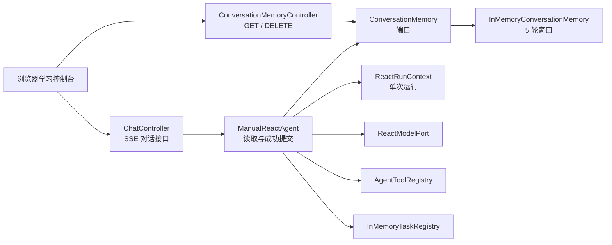
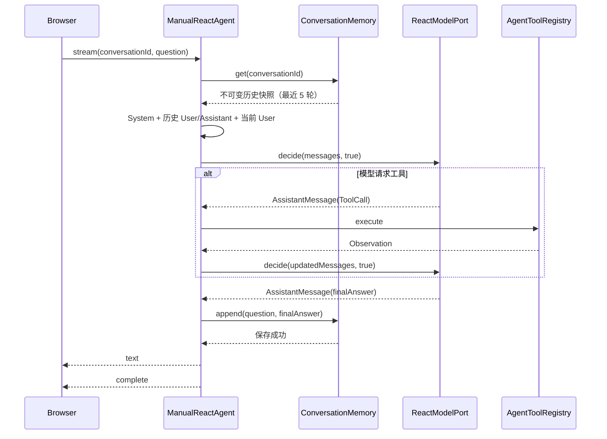

# 第三阶段：跨请求会话记忆

> 状态：已完成
> 阶段目标：在不引入数据库或框架记忆组件的前提下，手写一个按 `conversationId` 隔离、最多保存最近 5 轮的进程内会话记忆。
> 前置阶段：最小流式 Agent、手写 ReAct Agent 与本地工具系统。

## 1. 本阶段解决什么问题

第二阶段的 `ManualReactAgent` 已经能在一次 HTTP 请求中完成多轮「模型决策 → 工具调用 → Observation 回填」，但请求结束后，`ReactRunContext` 会被释放。下一次请求即使带着相同的 `conversationId`，模型也不知道上一次的问答。

本阶段让 `conversationId` 同时成为已完成对话的索引。用户可以先说「我叫小明」，在同一会话的下一次请求中再问「我叫什么」，模型收到的上下文会包含前一次成功问答。

这不是长期记忆，更不是数据库持久化。应用重启后内存数据会丢失；这一阶段的重点是理解跨请求数据的读取、提交、窗口裁剪和失败边界。

## 2. 目标、边界与非目标

### 2.1 已实现目标

- 相同 `conversationId` 能读取此前成功完成的问答。
- 不同 `conversationId` 的历史完全隔离。
- 每个会话最多保留最近 5 轮完整问答。
- 历史只保存用户问题和最终助手回答。
- 工具调用、工具参数、Observation 和模型内部推理不进入跨请求记忆。
- 失败、空答案、取消、客户端断开和并发拒绝不会提交半轮历史。
- 提供查询、清空和浏览器记忆面板。

### 2.2 本阶段不做的事情

- 不使用 MySQL、Redis、向量数据库或 Spring AI `ChatMemory`。
- 不跨进程或跨实例共享会话。
- 不按 Token 精确裁剪，不自动摘要旧历史。
- 不提供登录、权限、会话列表、搜索或分页。
- 不展示 Thought、Chain of Thought 或其他内部推理。

## 3. 两类状态不能混在一起

`ReactRunContext` 和 `ConversationMemory` 都会保存消息，但它们的生命周期不同。

| 状态 | 所属范围 | 创建与释放 | 保存内容 |
| --- | --- | --- | --- |
| `ReactRunContext` | 一次 Agent 请求 | SSE 订阅开始到完成、失败或取消 | System、当前 User、Assistant、ToolCall、ToolResponse 与终止状态 |
| `ConversationMemory` | 多次成功请求组成的会话 | 第一次成功保存到显式 DELETE 或应用退出 | `ConversationTurn(userContent, assistantContent)` |
| `InMemoryTaskRegistry` | 正在运行的任务 | 注册到完成或取消 | 取消回调、工作订阅句柄与运行状态 |

若把跨请求历史放入 `ReactRunContext`，请求结束时它会被释放；若把工具轨迹放进 `ConversationMemory`，下一次请求会携带无关且可能敏感的内部过程。因此，两个组件必须分开。

## 4. 架构与依赖方向



核心原则是：Web 层不访问内部 Map，Agent 不管理 HTTP 响应，内存实现不依赖 Spring AI 的 `Message` 类型。这样未来替换为 Redis 或数据库时，`ManualReactAgent` 仍只依赖 `ConversationMemory` 接口。

## 5. 核心类型与职责

### 5.1 `ConversationTurn`

`ConversationTurn` 是不可变 record，包含 `userContent` 与 `assistantContent`。构造时拒绝 `null`、空串和纯空白内容，因为半轮或空轮没有可重放的对话语义。

### 5.2 `ConversationMemory`

端口只定义三个操作：

```java
List<ConversationTurn> get(String conversationId);
void append(String conversationId, ConversationTurn turn);
boolean clear(String conversationId);
```

`get` 返回不可修改快照；`append` 只接收完整轮次；`clear` 返回清空前是否存在该会话窗口。

### 5.3 `InMemoryConversationMemory`

内部是 `ConcurrentMap<String, ConversationWindow>`。Map 负责不同会话键的并发访问，每个 `ConversationWindow` 再用自己的同步方法保护有序队列。不同会话无需争抢全局锁。

窗口容量固定为 5。第 6 轮追加后，删除最旧的完整 `ConversationTurn`：

```text
[1, 2, 3, 4, 5] + 6
→ 删除 1
→ [2, 3, 4, 5, 6]
```

返回值使用 `List.copyOf(...)`。调用者即使持有历史列表，也不能修改内部队列，更不会改变已经启动的 Agent 上下文。

### 5.4 `ManualReactAgent`

它在 `boundedElastic` 工作线程的开始阶段读取一次历史快照，并按下面顺序组装模型消息：

```text
SystemMessage(SYSTEM_PROMPT)
历史 UserMessage / AssistantMessage（按轮次、按时间顺序）
UserMessage(当前问题)
```

随后工具调用仍只写入当前 `ReactRunContext`。最终答案有效、未取消且获得唯一终止权后，Agent 先保存 `ConversationTurn`，成功后才发送 `text` 与 `complete`。因此，用户看到的成功答案必然已经进入记忆。

### 5.5 `ConversationMemoryController`

它是薄 Web 边界：只把 HTTP 请求映射为端口调用和 JSON DTO，不复制窗口裁剪或并发逻辑。

### 5.6 学习控制台

页面启动时读取一次历史；「刷新记忆」只 GET；「清空记忆」发送 DELETE 后再 GET。历史条目由 `document.createElement` 和 `textContent` 创建，不能把历史内容传给 `innerHTML`。本次请求只有收到最终 `text` 且没有 `error` 后，`complete` 才触发自动刷新。

## 6. 一次请求的时序



历史在请求开始时只读取一次。运行中执行 DELETE 不会修改该请求已经装入 `ReactRunContext` 的快照；如果运行随后成功，它的问答会成为清空后的第一轮。

## 7. 终止语义：什么时候保存

| 场景 | 读取旧历史 | 保存当前轮 | SSE 协议 |
| --- | --- | --- | --- |
| 直接得到最终答案 | 是 | 是 | `text` → `complete` |
| 工具后得到最终答案 | 是 | 是 | `tool_start` / `tool_end` → `text` → `complete` |
| 模型异常 | 是 | 否 | `error` → `complete` |
| 最终答案为空 | 是 | 否 | `error` → `complete` |
| 主动停止或浏览器断开 | 可能已读取 | 否 | 已连接客户端收到取消协议；断开客户端不可见 |
| 同会话并发请求 | 不读取或不使用 | 否 | `error` → `complete` |
| 记忆读取失败 | 失败 | 否 | `error` → `complete`，不调用模型 |
| 记忆保存失败 | 是 | 否 | `error` → `complete`，不发送 `text` |

保存失败分支尤其重要：它已经取得了 `context.tryFinish()` 的终止权，不能再调用会进行第二次 `tryFinish()` 的通用错误方法，否则错误事件不会发出。

## 8. API 与并发语义

### 查询记忆

```http
GET /api/agent/conversations/c-100/memory
```

```json
{
  "conversationId": "c-100",
  "turns": [
    {
      "userContent": "我叫小明",
      "assistantContent": "你好，小明！"
    }
  ]
}
```

未知会话返回 HTTP 200 与空数组，而不是 404。

### 清空记忆

```http
DELETE /api/agent/conversations/c-100/memory
```

```json
{"cleared": true}
```

重复清空返回 `{"cleared": false}`。DELETE 不取消正在运行的 Agent，不改变其已读取快照；它只删除调用时已经保存的窗口。

## 9. 完整核心伪代码

### 9.1 内存窗口

```text
class InMemoryConversationMemory:
    windows = ConcurrentMap<conversationId, ConversationWindow>
    MAX_TURNS = 5

    get(conversationId):
        validate conversationId
        window = windows.get(conversationId)
        if window absent:
            return immutable empty list
        return window.snapshot()

    append(conversationId, turn):
        validate conversationId and turn
        windows.compute(conversationId, (key, window) ->
            target = window or new ConversationWindow
            target.appendAndTrim(turn)
            return target)

    clear(conversationId):
        validate conversationId
        return windows.remove(conversationId) != null

class ConversationWindow:
    turns = ordered deque

    synchronized snapshot():
        return immutable copy(turns)

    synchronized appendAndTrim(turn):
        turns.addLast(turn)
        while turns.size > MAX_TURNS:
            turns.removeFirst()
```

### 9.2 初始化上下文并运行 ReAct

```text
runLoop(conversationId, question):
    history = memory.get(conversationId)       # 只读一次快照
    messages = [SystemMessage(SYSTEM_PROMPT)]
    for turn in history:
        messages.add(UserMessage(turn.userContent))
        messages.add(AssistantMessage(turn.assistantContent))
    messages.add(UserMessage(question))
    context = ReactRunContext(messages)

    while not cancelled and canStartDecisionRound:
        assistant = model.decide(context.messages, toolsEnabled = true)
        if assistant has no ToolCall:
            finishSuccessfully(question, assistant.text)
            return
        emit tool_start for each tool call
        execute tools sequentially
        emit tool_end for each observation
        append ToolResponseMessage to context

    request one final decision with tools disabled
    finishSuccessfully(question, finalAssistant.text)
```

### 9.3 成功、失败与取消

```text
finishSuccessfully(question, answer):
    if answer blank:
        finishWithError("模型未返回最终答案")
        return
    if cancelled or tryFinish() is false:
        return
    try:
        memory.append(conversationId, ConversationTurn(question, answer))
    catch memoryError:
        tasks.complete(conversationId)
        emit error("会话记忆保存失败")
        emit complete
        close output
        return
    tasks.complete(conversationId)
    emit text(answer)
    emit complete
    close output

finishWithError(message):
    if tryFinish():
        do not append memory
        tasks.complete(conversationId)
        emit error(message)
        emit complete
        close output

onCancel():
    markCancelled()
    if tryFinish():
        do not append memory
        emit error("request cancelled")
        emit complete
        close output
```

## 10. 测试策略

| 测试 | 验证重点 |
| --- | --- |
| `ConversationTurnTest` | 空白用户问题或助手回答被拒绝 |
| `InMemoryConversationMemoryTest` | 隔离、顺序、五轮裁剪、不可变快照、清空与并发追加 |
| `ManualReactAgentMemoryTest` | 历史消息顺序、成功保存、失败/取消不保存、读取/保存异常协议 |
| `ConversationMemoryControllerTest` | GET、DELETE、未知会话和存储异常映射 |
| `LearningConsoleContractTest` | 记忆面板、接口路径、DELETE 与 `textContent` 安全约束 |
| 既有 ReAct 与 Web 测试 | SSE、工具生命周期、取消和同会话互斥没有回归 |

建议每次修改记忆行为时先写失败测试：先证明缺少预期，再写最小实现使其变绿。这样终止路径和并发边界不会只停留在手工试用层面。

## 11. 手工验证步骤

1. 启动应用，打开学习控制台，确认记忆面板先显示「尚未加载记忆」，随后显示空历史。
2. 使用同一浏览器页面提问「我叫小明」，等待 `text` 和 `complete`。
3. 点击「刷新记忆」，确认面板出现完整用户问题与最终回答。
4. 再问「我叫什么」，确认模型能利用上一轮信息。
5. 连续完成 6 轮后刷新，确认只显示最近 5 轮。
6. 触发天气或计算器工具，确认记忆面板没有工具参数和 Observation。
7. 发起请求后点击「停止」，再刷新记忆，确认取消请求没有新增轮次。
8. 点击「清空记忆」，确认 GET 返回空数组；下一次成功回答成为第一轮。

## 12. 常见问题

### 为什么历史不直接保存 Spring AI `Message`？

`Message` 会把业务记忆绑定到框架类型，也可能包含工具协议细节。`ConversationTurn` 只保存稳定业务数据，读取时再转换为 `UserMessage` 与 `AssistantMessage`，替换存储或模型实现都更容易。

### 为什么不在收到用户问题时立刻保存？

那会产生半轮历史。模型异常、用户取消或工具执行失败时，下一次请求会读到没有对应最终回答的上下文，角色顺序和业务语义都会被破坏。

### 为什么 DELETE 不取消正在运行的任务？

清空历史与取消计算是两种不同意图。前者管理已完成数据，后者管理正在运行的工作订阅；把它们耦合会让普通的历史管理操作意外终止用户请求。

## 13. 下一阶段可以怎么演进

当前端口已把 Agent 与存储解耦，下一阶段可以选择一个方向继续学习：

- 将 `ConversationMemory` 替换为 JDBC/MySQL 持久化实现。
- 使用 Redis 保存热窗口，并学习多实例会话共享。
- 引入 Token 预算和旧轮次摘要。
- 增加会话列表、标题、用户身份与权限隔离。

无论选择哪一项，都应保留本阶段的核心不变量：按完整轮次保存、读取不可变快照、失败与取消不提交、工具轨迹默认不进入跨请求历史。
